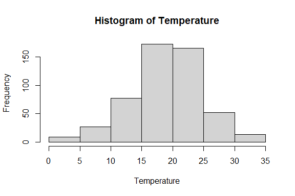
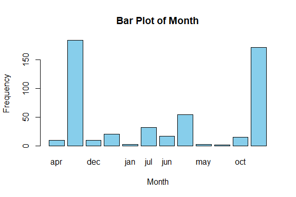
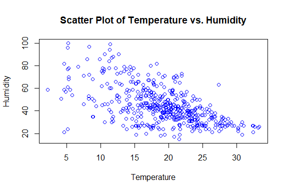
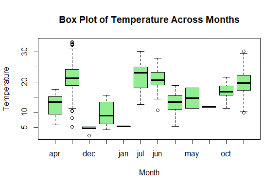

Forest Fires Prediction
================
Trevor Okinda
2024

- [Student Details](#student-details)
- [Setup Chunk](#setup-chunk)
  - [Source:](#source)
  - [Reference:](#reference)
- [Understanding the Dataset (Exploratory Data Analysis
  (EDA))](#understanding-the-dataset-exploratory-data-analysis-eda)
  - [Loading the Dataset](#loading-the-dataset)
  - [Measures of Frequency](#measures-of-frequency)
  - [Measures of Central Tendency](#measures-of-central-tendency)
  - [Measures of Distribution](#measures-of-distribution)
  - [Measures of Relationship](#measures-of-relationship)
  - [ANOVA](#anova)
  - [Plots](#plots)
- [Preprocessing & Data
  Transformation](#preprocessing--data-transformation)
  - [Missing Values](#missing-values)
  - [Transformation](#transformation)
- [Training Model](#training-model)
  - [Data Splitting](#data-splitting)
  - [Bootstrapping](#bootstrapping)
  - [Cross-validation](#cross-validation)
  - [Training Different Models](#training-different-models)

# Student Details

|                       |                         |
|-----------------------|-------------------------|
| **Student ID Number** | 134780                  |
| **Student Name**      | Trevor Okinda           |
| **BBIT 4.2 Group**    | C                       |
| **Project Name**      | Forest Fires Prediction |

# Setup Chunk

**Note:** the following KnitR options have been set as the global
defaults: <BR>
`knitr::opts_chunk$set(echo = TRUE, warning = FALSE, eval = TRUE, collapse = FALSE, tidy = TRUE)`.

More KnitR options are documented here
<https://bookdown.org/yihui/rmarkdown-cookbook/chunk-options.html> and
here <https://yihui.org/knitr/options/>.

### Source:

The dataset that was used can be downloaded here: *\<<a
href="https://www.kaggle.com/datasets/shubhammeshram579/forest-fires-prediction\"
class="uri">https://www.kaggle.com/datasets/shubhammeshram579/forest-fires-prediction\</a>\>*

### Reference:

*\<Meshram, S. (n.d.). Forest Fires Prediction \[Data set\]. Kaggle. <a
href="https://www.kaggle.com/datasets/shubhammeshram579/forest-fires-prediction\"
class="uri">https://www.kaggle.com/datasets/shubhammeshram579/forest-fires-prediction\</a>\>  
Refer to the APA 7th edition manual for rules on how to cite datasets:
<https://apastyle.apa.org/style-grammar-guidelines/references/examples/data-set-references>*

# Understanding the Dataset (Exploratory Data Analysis (EDA))

## Loading the Dataset

``` r
# Load dataset
forest_fire_data <- read.csv("forest_fires.csv", colClasses = c(
  X = "numeric",
  Y = "numeric",
  month = "factor",
  day = "factor",
  FFMC = "numeric",
  DMC = "numeric",
  DC = "numeric",
  ISI = "numeric",
  temp = "numeric",
  RH = "numeric",
  wind = "numeric",
  rain = "numeric",
  area = "numeric"
))

# Display the structure of the dataset
str(forest_fire_data)
```

    ## 'data.frame':    517 obs. of  13 variables:
    ##  $ X    : num  7 7 7 8 8 8 8 8 8 7 ...
    ##  $ Y    : num  5 4 4 6 6 6 6 6 6 5 ...
    ##  $ month: Factor w/ 12 levels "apr","aug","dec",..: 8 11 11 8 8 2 2 2 12 12 ...
    ##  $ day  : Factor w/ 7 levels "fri","mon","sat",..: 1 6 3 1 4 4 2 2 6 3 ...
    ##  $ FFMC : num  86.2 90.6 90.6 91.7 89.3 92.3 92.3 91.5 91 92.5 ...
    ##  $ DMC  : num  26.2 35.4 43.7 33.3 51.3 ...
    ##  $ DC   : num  94.3 669.1 686.9 77.5 102.2 ...
    ##  $ ISI  : num  5.1 6.7 6.7 9 9.6 14.7 8.5 10.7 7 7.1 ...
    ##  $ temp : num  8.2 18 14.6 8.3 11.4 22.2 24.1 8 13.1 22.8 ...
    ##  $ RH   : num  51 33 33 97 99 29 27 86 63 40 ...
    ##  $ wind : num  6.7 0.9 1.3 4 1.8 5.4 3.1 2.2 5.4 4 ...
    ##  $ rain : num  0 0 0 0.2 0 0 0 0 0 0 ...
    ##  $ area : num  0 0 0 0 0 0 0 0 0 0 ...

``` r
# View the first few rows of the dataset
head(forest_fire_data)
```

    ##   X Y month day FFMC  DMC    DC  ISI temp RH wind rain area
    ## 1 7 5   mar fri 86.2 26.2  94.3  5.1  8.2 51  6.7  0.0    0
    ## 2 7 4   oct tue 90.6 35.4 669.1  6.7 18.0 33  0.9  0.0    0
    ## 3 7 4   oct sat 90.6 43.7 686.9  6.7 14.6 33  1.3  0.0    0
    ## 4 8 6   mar fri 91.7 33.3  77.5  9.0  8.3 97  4.0  0.2    0
    ## 5 8 6   mar sun 89.3 51.3 102.2  9.6 11.4 99  1.8  0.0    0
    ## 6 8 6   aug sun 92.3 85.3 488.0 14.7 22.2 29  5.4  0.0    0

``` r
# View the dataset in a separate viewer window
View(forest_fire_data)
```

## Measures of Frequency

``` r
# Measures of Frequency
# Frequency of occurrences for month
month_freq <- table(forest_fire_data$month)
print("Frequency of occurrences for month:")
```

    ## [1] "Frequency of occurrences for month:"

``` r
print(month_freq)
```

    ## 
    ## apr aug dec feb jan jul jun mar may nov oct sep 
    ##   9 184   9  20   2  32  17  54   2   1  15 172

``` r
# Frequency of occurrences for day
day_freq <- table(forest_fire_data$day)
print("Frequency of occurrences for day:")
```

    ## [1] "Frequency of occurrences for day:"

``` r
print(day_freq)
```

    ## 
    ## fri mon sat sun thu tue wed 
    ##  85  74  84  95  61  64  54

## Measures of Central Tendency

``` r
# Measures of Central Tendency
# Mean, Median, and Mode for temperature
temp_mean <- mean(forest_fire_data$temp)
temp_median <- median(forest_fire_data$temp)
temp_mode <- names(sort(table(forest_fire_data$temp), decreasing = TRUE))[1]
print("Measures of Central Tendency for temperature:")
```

    ## [1] "Measures of Central Tendency for temperature:"

``` r
print(paste("Mean:", temp_mean))
```

    ## [1] "Mean: 18.88916827853"

``` r
print(paste("Median:", temp_median))
```

    ## [1] "Median: 19.3"

``` r
print(paste("Mode:", temp_mode))
```

    ## [1] "Mode: 17.4"

``` r
# Mean, Median, and Mode for humidity
RH_mean <- mean(forest_fire_data$RH)
RH_median <- median(forest_fire_data$RH)
RH_mode <- names(sort(table(forest_fire_data$RH), decreasing = TRUE))[1]
print("Measures of Central Tendency for humidity:")
```

    ## [1] "Measures of Central Tendency for humidity:"

``` r
print(paste("Mean:", RH_mean))
```

    ## [1] "Mean: 44.2882011605416"

``` r
print(paste("Median:", RH_median))
```

    ## [1] "Median: 42"

``` r
print(paste("Mode:", RH_mode))
```

    ## [1] "Mode: 27"

## Measures of Distribution

``` r
# Measures of Distribution
# Range, Variance, and Standard Deviation for temperature
temp_range <- range(forest_fire_data$temp)
temp_variance <- var(forest_fire_data$temp)
temp_sd <- sd(forest_fire_data$temp)
print("Measures of Distribution for temperature:")
```

    ## [1] "Measures of Distribution for temperature:"

``` r
print(paste("Range:", temp_range[2] - temp_range[1]))
```

    ## [1] "Range: 31.1"

``` r
print(paste("Variance:", temp_variance))
```

    ## [1] "Variance: 33.7168979503096"

``` r
print(paste("Standard Deviation:", temp_sd))
```

    ## [1] "Standard Deviation: 5.8066253495735"

``` r
# Range, Variance, and Standard Deviation for humidity
RH_range <- range(forest_fire_data$RH)
RH_variance <- var(forest_fire_data$RH)
RH_sd <- sd(forest_fire_data$RH)
print("Measures of Distribution for humidity:")
```

    ## [1] "Measures of Distribution for humidity:"

``` r
print(paste("Range:", RH_range[2] - RH_range[1]))
```

    ## [1] "Range: 85"

``` r
print(paste("Variance:", RH_variance))
```

    ## [1] "Variance: 266.259802378061"

``` r
print(paste("Standard Deviation:", RH_sd))
```

    ## [1] "Standard Deviation: 16.3174692393784"

## Measures of Relationship

``` r
# Measures of Relationship
# Correlation between temperature and humidity
temp_RH_correlation <- cor(forest_fire_data$temp, forest_fire_data$RH)
print("Correlation between temperature and humidity:")
```

    ## [1] "Correlation between temperature and humidity:"

``` r
print(temp_RH_correlation)
```

    ## [1] -0.5273903

``` r
# Correlation between temperature and area
temp_area_correlation <- cor(forest_fire_data$temp, forest_fire_data$area)
print("Correlation between temperature and area:")
```

    ## [1] "Correlation between temperature and area:"

``` r
print(temp_area_correlation)
```

    ## [1] 0.09784411

## ANOVA

``` r
# Perform ANOVA on temperature across different months
anova_result <- aov(temp ~ month, data = forest_fire_data)

# Print ANOVA summary
print(summary(anova_result))
```

    ##              Df Sum Sq Mean Sq F value Pr(>F)    
    ## month        11   8168   742.6   40.63 <2e-16 ***
    ## Residuals   505   9230    18.3                   
    ## ---
    ## Signif. codes:  0 '***' 0.001 '**' 0.01 '*' 0.05 '.' 0.1 ' ' 1

## Plots

``` r
# Univariate Plots
# Histogram of temperature
hist(forest_fire_data$temp, main = "Histogram of Temperature", xlab = "Temperature")
```

<!-- -->

``` r
# Bar plot of month
barplot(table(forest_fire_data$month), main = "Bar Plot of Month", xlab = "Month", ylab = "Frequency", col = "skyblue")
```

<!-- -->

``` r
# Multivariate Plots
# Scatter plot of temperature vs. humidity
plot(forest_fire_data$temp, forest_fire_data$RH, main = "Scatter Plot of Temperature vs. Humidity", xlab = "Temperature", ylab = "Humidity", col = "blue")
```

<!-- -->

``` r
# Box plot of temperature across different months
boxplot(temp ~ month, data = forest_fire_data, main = "Box Plot of Temperature Across Months", xlab = "Month", ylab = "Temperature", col = "lightgreen")
```

<!-- -->

# Preprocessing & Data Transformation

## Missing Values

``` r
# Check for missing values
missing_values <- sum(is.na(forest_fire_data))

# Display summary of missing values
print(paste("Number of missing values:", missing_values))
```

    ## [1] "Number of missing values: 0"

``` r
# Summary of missing values by column
print(summary(is.na(forest_fire_data)))
```

    ##      X               Y             month            day         
    ##  Mode :logical   Mode :logical   Mode :logical   Mode :logical  
    ##  FALSE:517       FALSE:517       FALSE:517       FALSE:517      
    ##     FFMC            DMC              DC             ISI         
    ##  Mode :logical   Mode :logical   Mode :logical   Mode :logical  
    ##  FALSE:517       FALSE:517       FALSE:517       FALSE:517      
    ##     temp             RH             wind            rain        
    ##  Mode :logical   Mode :logical   Mode :logical   Mode :logical  
    ##  FALSE:517       FALSE:517       FALSE:517       FALSE:517      
    ##     area        
    ##  Mode :logical  
    ##  FALSE:517

## Transformation

``` r
# Transform "area" variable using ln(x + 1) function
forest_fire_data$ln_area <- log(forest_fire_data$area + 1)

# Display the structure of the dataset to verify the transformation
str(forest_fire_data)
```

    ## 'data.frame':    517 obs. of  14 variables:
    ##  $ X      : num  7 7 7 8 8 8 8 8 8 7 ...
    ##  $ Y      : num  5 4 4 6 6 6 6 6 6 5 ...
    ##  $ month  : Factor w/ 12 levels "apr","aug","dec",..: 8 11 11 8 8 2 2 2 12 12 ...
    ##  $ day    : Factor w/ 7 levels "fri","mon","sat",..: 1 6 3 1 4 4 2 2 6 3 ...
    ##  $ FFMC   : num  86.2 90.6 90.6 91.7 89.3 92.3 92.3 91.5 91 92.5 ...
    ##  $ DMC    : num  26.2 35.4 43.7 33.3 51.3 ...
    ##  $ DC     : num  94.3 669.1 686.9 77.5 102.2 ...
    ##  $ ISI    : num  5.1 6.7 6.7 9 9.6 14.7 8.5 10.7 7 7.1 ...
    ##  $ temp   : num  8.2 18 14.6 8.3 11.4 22.2 24.1 8 13.1 22.8 ...
    ##  $ RH     : num  51 33 33 97 99 29 27 86 63 40 ...
    ##  $ wind   : num  6.7 0.9 1.3 4 1.8 5.4 3.1 2.2 5.4 4 ...
    ##  $ rain   : num  0 0 0 0.2 0 0 0 0 0 0 ...
    ##  $ area   : num  0 0 0 0 0 0 0 0 0 0 ...
    ##  $ ln_area: num  0 0 0 0 0 0 0 0 0 0 ...

# Training Model

## Data Splitting

``` r
library(caret)
```

    ## Loading required package: ggplot2

    ## Loading required package: lattice

``` r
# Data Splitting
set.seed(123) # Set seed for reproducibility
train_index <- sample(1:nrow(forest_fire_data), 0.8 * nrow(forest_fire_data)) # 80% for training
train_data <- forest_fire_data[train_index, ]
test_data <- forest_fire_data[-train_index, ]

# Print the dimensions of the training and testing sets
print("Dimensions of Training Data:")
```

    ## [1] "Dimensions of Training Data:"

``` r
print(dim(train_data))
```

    ## [1] 413  14

``` r
print("Dimensions of Testing Data:")
```

    ## [1] "Dimensions of Testing Data:"

``` r
print(dim(test_data))
```

    ## [1] 104  14

## Bootstrapping

``` r
# Bootstrapping
bootstrap_samples <- lapply(1:1000, function(i) {
  bootstrap_index <- sample(1:nrow(forest_fire_data), replace = TRUE)
  bootstrap_data <- forest_fire_data[bootstrap_index, ]
})

# Calculate mean and median for each bootstrap sample
bootstrap_stats <- sapply(bootstrap_samples, function(sample_data) {
  mean_value <- mean(sample_data$area)
  median_value <- median(sample_data$area)
  return(c(mean_value, median_value))
})

# Calculate confidence intervals for mean and median
confidence_intervals <- t(sapply(bootstrap_stats, function(stat) {
  quantile(stat, c(0.025, 0.975))
}))

# Print confidence intervals
print("Confidence intervals for mean and median:")
```

    ## [1] "Confidence intervals for mean and median:"

``` r
print(confidence_intervals)
```

    ##              2.5%     97.5%
    ##    [1,] 14.823288 14.823288
    ##    [2,]  0.520000  0.520000
    ##    [3,] 12.697582 12.697582
    ##    [4,]  0.680000  0.680000
    ##    [5,]  9.403404  9.403404
    ##    [6,]  0.410000  0.410000
    ##    [7,] 15.726828 15.726828
    ##    [8,]  1.190000  1.190000
    ##    [9,]  8.109768  8.109768
    ##   [10,]  0.000000  0.000000
    ##   [11,] 11.078685 11.078685
    ##   [12,]  0.410000  0.410000
    ##   [13,] 16.899265 16.899265
    ##   [14,]  0.900000  0.900000
    ##   [15,] 13.109942 13.109942
    ##   [16,]  0.720000  0.720000
    ##   [17,] 10.703385 10.703385
    ##   [18,]  0.770000  0.770000
    ##   [19,]  8.708279  8.708279
    ##   [20,]  0.610000  0.610000
    ##   [21,] 11.123926 11.123926
    ##   [22,]  0.000000  0.000000
    ##   [23,] 13.840251 13.840251
    ##   [24,]  0.790000  0.790000
    ##   [25,] 12.336267 12.336267
    ##   [26,]  0.550000  0.550000
    ##   [27,] 17.608607 17.608607
    ##   [28,]  0.950000  0.950000
    ##   [29,] 12.566499 12.566499
    ##   [30,]  1.430000  1.430000
    ##   [31,] 18.431779 18.431779
    ##   [32,]  0.550000  0.550000
    ##   [33,] 13.811006 13.811006
    ##   [34,]  0.710000  0.710000
    ##   [35,] 12.725571 12.725571
    ##   [36,]  0.770000  0.770000
    ##   [37,] 11.753540 11.753540
    ##   [38,]  0.550000  0.550000
    ##   [39,] 15.060116 15.060116
    ##   [40,]  0.000000  0.000000
    ##   [41,] 11.503056 11.503056
    ##   [42,]  0.000000  0.000000
    ##   [43,]  9.613133  9.613133
    ##   [44,]  0.470000  0.470000
    ##   [45,] 14.537814 14.537814
    ##   [46,]  0.000000  0.000000
    ##   [47,] 10.179807 10.179807
    ##   [48,]  1.100000  1.100000
    ##   [49,] 19.265764 19.265764
    ##   [50,]  0.610000  0.610000
    ##   [51,] 12.968066 12.968066
    ##   [52,]  0.000000  0.000000
    ##   [53,] 10.994507 10.994507
    ##   [54,]  0.720000  0.720000
    ##   [55,] 10.525087 10.525087
    ##   [56,]  0.210000  0.210000
    ##   [57,] 12.252340 12.252340
    ##   [58,]  0.520000  0.520000
    ##   [59,] 13.131644 13.131644
    ##   [60,]  0.000000  0.000000
    ##   [61,]  8.664159  8.664159
    ##   [62,]  0.900000  0.900000
    ##   [63,] 11.897621 11.897621
    ##   [64,]  0.430000  0.430000
    ##   [65,]  9.777640  9.777640
    ##   [66,]  0.430000  0.430000
    ##   [67,] 15.265493 15.265493
    ##   [68,]  0.000000  0.000000
    ##   [69,] 11.754565 11.754565
    ##   [70,]  1.070000  1.070000
    ##   [71,] 11.192553 11.192553
    ##   [72,]  0.000000  0.000000
    ##   [73,]  8.129981  8.129981
    ##   [74,]  0.520000  0.520000
    ##   [75,] 10.593752 10.593752
    ##   [76,]  0.720000  0.720000
    ##   [77,] 13.531238 13.531238
    ##   [78,]  0.520000  0.520000
    ##   [79,] 12.677447 12.677447
    ##   [80,]  0.760000  0.760000
    ##   [81,] 10.930580 10.930580
    ##   [82,]  0.520000  0.520000
    ##   [83,] 15.381412 15.381412
    ##   [84,]  0.000000  0.000000
    ##   [85,]  9.816596  9.816596
    ##   [86,]  0.000000  0.000000
    ##   [87,] 11.705745 11.705745
    ##   [88,]  0.330000  0.330000
    ##   [89,] 11.682302 11.682302
    ##   [90,]  0.210000  0.210000
    ##   [91,] 13.798956 13.798956
    ##   [92,]  0.610000  0.610000
    ##   [93,]  9.801876  9.801876
    ##   [94,]  0.680000  0.680000
    ##   [95,] 12.253075 12.253075
    ##   [96,]  0.520000  0.520000
    ##   [97,] 14.848221 14.848221
    ##   [98,]  0.770000  0.770000
    ##   [99,] 14.328143 14.328143
    ##  [100,]  0.000000  0.000000
    ##  [101,] 11.406190 11.406190
    ##  [102,]  0.720000  0.720000
    ##  [103,]  8.917292  8.917292
    ##  [104,]  0.210000  0.210000
    ##  [105,] 11.435571 11.435571
    ##  [106,]  0.760000  0.760000
    ##  [107,] 16.423056 16.423056
    ##  [108,]  0.900000  0.900000
    ##  [109,] 12.535841 12.535841
    ##  [110,]  0.790000  0.790000
    ##  [111,] 14.157853 14.157853
    ##  [112,]  0.760000  0.760000
    ##  [113,] 16.811257 16.811257
    ##  [114,]  0.520000  0.520000
    ##  [115,] 12.427776 12.427776
    ##  [116,]  0.720000  0.720000
    ##  [117,] 10.276074 10.276074
    ##  [118,]  0.000000  0.000000
    ##  [119,]  9.324797  9.324797
    ##  [120,]  0.430000  0.430000
    ##  [121,] 11.335745 11.335745
    ##  [122,]  0.170000  0.170000
    ##  [123,] 10.948375 10.948375
    ##  [124,]  0.770000  0.770000
    ##  [125,]  8.839981  8.839981
    ##  [126,]  0.000000  0.000000
    ##  [127,] 11.249478 11.249478
    ##  [128,]  0.790000  0.790000
    ##  [129,] 14.170658 14.170658
    ##  [130,]  0.410000  0.410000
    ##  [131,] 10.649942 10.649942
    ##  [132,]  0.430000  0.430000
    ##  [133,] 13.699613 13.699613
    ##  [134,]  0.720000  0.720000
    ##  [135,] 10.818762 10.818762
    ##  [136,]  0.360000  0.360000
    ##  [137,] 11.194913 11.194913
    ##  [138,]  0.680000  0.680000
    ##  [139,] 11.909903 11.909903
    ##  [140,]  0.770000  0.770000
    ##  [141,] 12.691741 12.691741
    ##  [142,]  0.000000  0.000000
    ##  [143,] 10.139632 10.139632
    ##  [144,]  1.460000  1.460000
    ##  [145,] 12.355532 12.355532
    ##  [146,]  0.000000  0.000000
    ##  [147,] 21.589207 21.589207
    ##  [148,]  0.540000  0.540000
    ##  [149,]  9.811354  9.811354
    ##  [150,]  0.240000  0.240000
    ##  [151,] 12.192631 12.192631
    ##  [152,]  0.710000  0.710000
    ##  [153,] 11.948201 11.948201
    ##  [154,]  0.360000  0.360000
    ##  [155,] 14.698085 14.698085
    ##  [156,]  0.720000  0.720000
    ##  [157,] 13.669188 13.669188
    ##  [158,]  0.000000  0.000000
    ##  [159,] 17.278897 17.278897
    ##  [160,]  1.070000  1.070000
    ##  [161,] 13.866963 13.866963
    ##  [162,]  1.070000  1.070000
    ##  [163,] 11.967099 11.967099
    ##  [164,]  0.540000  0.540000
    ##  [165,] 12.320832 12.320832
    ##  [166,]  0.170000  0.170000
    ##  [167,] 16.531335 16.531335
    ##  [168,]  0.430000  0.430000
    ##  [169,] 16.197756 16.197756
    ##  [170,]  0.610000  0.610000
    ##  [171,] 14.757466 14.757466
    ##  [172,]  0.170000  0.170000
    ##  [173,]  9.908104  9.908104
    ##  [174,]  0.900000  0.900000
    ##  [175,] 11.284603 11.284603
    ##  [176,]  0.760000  0.760000
    ##  [177,] 14.101373 14.101373
    ##  [178,]  0.240000  0.240000
    ##  [179,]  8.341663  8.341663
    ##  [180,]  0.610000  0.610000
    ##  [181,] 15.930522 15.930522
    ##  [182,]  0.000000  0.000000
    ##  [183,] 16.232224 16.232224
    ##  [184,]  0.410000  0.410000
    ##  [185,] 16.907002 16.907002
    ##  [186,]  0.610000  0.610000
    ##  [187,] 12.466170 12.466170
    ##  [188,]  0.540000  0.540000
    ##  [189,] 16.638859 16.638859
    ##  [190,]  0.000000  0.000000
    ##  [191,] 11.023694 11.023694
    ##  [192,]  0.430000  0.430000
    ##  [193,] 14.611373 14.611373
    ##  [194,]  0.610000  0.610000
    ##  [195,] 12.261857 12.261857
    ##  [196,]  0.360000  0.360000
    ##  [197,]  9.907988  9.907988
    ##  [198,]  0.770000  0.770000
    ##  [199,] 14.602186 14.602186
    ##  [200,]  0.770000  0.770000
    ##  [201,] 14.795648 14.795648
    ##  [202,]  0.720000  0.720000
    ##  [203,] 14.185899 14.185899
    ##  [204,]  1.010000  1.010000
    ##  [205,] 12.276015 12.276015
    ##  [206,]  0.430000  0.430000
    ##  [207,] 17.337389 17.337389
    ##  [208,]  0.210000  0.210000
    ##  [209,]  9.583501  9.583501
    ##  [210,]  0.680000  0.680000
    ##  [211,] 17.447563 17.447563
    ##  [212,]  0.790000  0.790000
    ##  [213,] 14.970716 14.970716
    ##  [214,]  0.240000  0.240000
    ##  [215,] 10.653965 10.653965
    ##  [216,]  0.950000  0.950000
    ##  [217,]  9.833443  9.833443
    ##  [218,]  0.680000  0.680000
    ##  [219,] 12.630832 12.630832
    ##  [220,]  0.000000  0.000000
    ##  [221,] 13.151779 13.151779
    ##  [222,]  0.720000  0.720000
    ##  [223,] 10.858994 10.858994
    ##  [224,]  0.540000  0.540000
    ##  [225,] 12.100213 12.100213
    ##  [226,]  0.000000  0.000000
    ##  [227,]  9.858491  9.858491
    ##  [228,]  0.540000  0.540000
    ##  [229,]  8.596112  8.596112
    ##  [230,]  1.010000  1.010000
    ##  [231,] 12.190387 12.190387
    ##  [232,]  0.240000  0.240000
    ##  [233,] 12.749052 12.749052
    ##  [234,]  0.610000  0.610000
    ##  [235,] 13.147447 13.147447
    ##  [236,]  0.000000  0.000000
    ##  [237,] 15.948027 15.948027
    ##  [238,]  0.000000  0.000000
    ##  [239,] 17.264894 17.264894
    ##  [240,]  0.430000  0.430000
    ##  [241,] 17.968917 17.968917
    ##  [242,]  0.410000  0.410000
    ##  [243,] 15.037060 15.037060
    ##  [244,]  0.680000  0.680000
    ##  [245,] 13.316015 13.316015
    ##  [246,]  0.680000  0.680000
    ##  [247,] 10.055242 10.055242
    ##  [248,]  0.090000  0.090000
    ##  [249,] 12.023733 12.023733
    ##  [250,]  0.720000  0.720000
    ##  [251,] 13.269613 13.269613
    ##  [252,]  0.430000  0.430000
    ##  [253,] 11.948549 11.948549
    ##  [254,]  0.900000  0.900000
    ##  [255,]  9.149265  9.149265
    ##  [256,]  0.550000  0.550000
    ##  [257,] 15.469478 15.469478
    ##  [258,]  0.750000  0.750000
    ##  [259,] 14.307756 14.307756
    ##  [260,]  0.000000  0.000000
    ##  [261,] 11.272940 11.272940
    ##  [262,]  0.610000  0.610000
    ##  [263,] 13.679671 13.679671
    ##  [264,]  0.770000  0.770000
    ##  [265,] 13.990290 13.990290
    ##  [266,]  0.900000  0.900000
    ##  [267,]  9.826518  9.826518
    ##  [268,]  0.550000  0.550000
    ##  [269,] 13.986112 13.986112
    ##  [270,]  0.000000  0.000000
    ##  [271,]  8.998433  8.998433
    ##  [272,]  0.330000  0.330000
    ##  [273,] 13.745648 13.745648
    ##  [274,]  0.000000  0.000000
    ##  [275,]  8.976422  8.976422
    ##  [276,]  0.540000  0.540000
    ##  [277,]  9.691567  9.691567
    ##  [278,]  0.430000  0.430000
    ##  [279,] 10.589807 10.589807
    ##  [280,]  0.170000  0.170000
    ##  [281,] 11.334874 11.334874
    ##  [282,]  0.520000  0.520000
    ##  [283,] 10.633965 10.633965
    ##  [284,]  0.520000  0.520000
    ##  [285,] 13.147834 13.147834
    ##  [286,]  0.000000  0.000000
    ##  [287,] 14.652901 14.652901
    ##  [288,]  0.000000  0.000000
    ##  [289,] 18.108975 18.108975
    ##  [290,]  0.950000  0.950000
    ##  [291,] 11.241006 11.241006
    ##  [292,]  0.430000  0.430000
    ##  [293,] 15.591876 15.591876
    ##  [294,]  0.470000  0.470000
    ##  [295,] 21.333095 21.333095
    ##  [296,]  0.610000  0.610000
    ##  [297,] 17.364333 17.364333
    ##  [298,]  0.360000  0.360000
    ##  [299,] 10.681625 10.681625
    ##  [300,]  0.550000  0.550000
    ##  [301,] 17.189884 17.189884
    ##  [302,]  0.520000  0.520000
    ##  [303,] 16.609304 16.609304
    ##  [304,]  0.900000  0.900000
    ##  [305,] 12.227524 12.227524
    ##  [306,]  0.000000  0.000000
    ##  [307,] 12.155629 12.155629
    ##  [308,]  0.750000  0.750000
    ##  [309,]  4.938221  4.938221
    ##  [310,]  0.000000  0.000000
    ##  [311,] 13.002070 13.002070
    ##  [312,]  0.790000  0.790000
    ##  [313,] 14.575319 14.575319
    ##  [314,]  0.950000  0.950000
    ##  [315,] 13.483965 13.483965
    ##  [316,]  0.900000  0.900000
    ##  [317,] 12.543288 12.543288
    ##  [318,]  0.960000  0.960000
    ##  [319,] 14.236692 14.236692
    ##  [320,]  0.000000  0.000000
    ##  [321,]  8.934236  8.934236
    ##  [322,]  0.520000  0.520000
    ##  [323,] 13.021973 13.021973
    ##  [324,]  0.960000  0.960000
    ##  [325,] 12.076654 12.076654
    ##  [326,]  0.950000  0.950000
    ##  [327,] 11.745184 11.745184
    ##  [328,]  0.000000  0.000000
    ##  [329,]  8.947350  8.947350
    ##  [330,]  0.550000  0.550000
    ##  [331,] 11.775532 11.775532
    ##  [332,]  0.090000  0.090000
    ##  [333,] 11.609903 11.609903
    ##  [334,]  0.000000  0.000000
    ##  [335,] 11.858162 11.858162
    ##  [336,]  0.550000  0.550000
    ##  [337,] 10.656557 10.656557
    ##  [338,]  0.550000  0.550000
    ##  [339,] 13.701857 13.701857
    ##  [340,]  0.000000  0.000000
    ##  [341,]  8.642689  8.642689
    ##  [342,]  0.000000  0.000000
    ##  [343,]  8.461257  8.461257
    ##  [344,]  0.000000  0.000000
    ##  [345,] 12.382418 12.382418
    ##  [346,]  0.170000  0.170000
    ##  [347,] 15.959304 15.959304
    ##  [348,]  0.610000  0.610000
    ##  [349,] 12.879110 12.879110
    ##  [350,]  1.090000  1.090000
    ##  [351,] 15.707021 15.707021
    ##  [352,]  0.550000  0.550000
    ##  [353,]  9.769516  9.769516
    ##  [354,]  0.770000  0.770000
    ##  [355,] 12.926364 12.926364
    ##  [356,]  0.090000  0.090000
    ##  [357,] 10.475184 10.475184
    ##  [358,]  0.360000  0.360000
    ##  [359,] 10.124913 10.124913
    ##  [360,]  0.760000  0.760000
    ##  [361,] 11.810193 11.810193
    ##  [362,]  0.000000  0.000000
    ##  [363,] 12.546809 12.546809
    ##  [364,]  0.900000  0.900000
    ##  [365,] 10.460851 10.460851
    ##  [366,]  0.900000  0.900000
    ##  [367,] 14.481818 14.481818
    ##  [368,]  0.710000  0.710000
    ##  [369,] 21.048665 21.048665
    ##  [370,]  0.000000  0.000000
    ##  [371,] 11.012147 11.012147
    ##  [372,]  0.000000  0.000000
    ##  [373,] 15.544739 15.544739
    ##  [374,]  0.210000  0.210000
    ##  [375,] 11.682456 11.682456
    ##  [376,]  0.520000  0.520000
    ##  [377,] 12.757930 12.757930
    ##  [378,]  1.230000  1.230000
    ##  [379,] 17.534603 17.534603
    ##  [380,]  0.360000  0.360000
    ##  [381,] 15.312785 15.312785
    ##  [382,]  0.790000  0.790000
    ##  [383,] 10.532998 10.532998
    ##  [384,]  0.710000  0.710000
    ##  [385,]  9.464932  9.464932
    ##  [386,]  0.000000  0.000000
    ##  [387,] 13.790426 13.790426
    ##  [388,]  0.750000  0.750000
    ##  [389,] 15.746267 15.746267
    ##  [390,]  0.760000  0.760000
    ##  [391,] 10.254159 10.254159
    ##  [392,]  0.720000  0.720000
    ##  [393,]  9.718975  9.718975
    ##  [394,]  0.710000  0.710000
    ##  [395,] 12.527369 12.527369
    ##  [396,]  0.960000  0.960000
    ##  [397,]  9.987950  9.987950
    ##  [398,]  0.000000  0.000000
    ##  [399,] 11.327621 11.327621
    ##  [400,]  0.520000  0.520000
    ##  [401,] 13.165629 13.165629
    ##  [402,]  0.520000  0.520000
    ##  [403,]  8.776692  8.776692
    ##  [404,]  0.000000  0.000000
    ##  [405,]  9.158569  9.158569
    ##  [406,]  0.170000  0.170000
    ##  [407,] 11.041838 11.041838
    ##  [408,]  0.410000  0.410000
    ##  [409,] 18.486576 18.486576
    ##  [410,]  0.000000  0.000000
    ##  [411,] 13.210019 13.210019
    ##  [412,]  0.090000  0.090000
    ##  [413,] 16.523211 16.523211
    ##  [414,]  1.260000  1.260000
    ##  [415,] 11.120890 11.120890
    ##  [416,]  0.550000  0.550000
    ##  [417,] 13.812766 13.812766
    ##  [418,]  0.430000  0.430000
    ##  [419,] 14.626132 14.626132
    ##  [420,]  0.610000  0.610000
    ##  [421,] 16.711838 16.711838
    ##  [422,]  0.470000  0.470000
    ##  [423,] 13.773965 13.773965
    ##  [424,]  0.610000  0.610000
    ##  [425,] 13.736731 13.736731
    ##  [426,]  0.520000  0.520000
    ##  [427,] 14.305938 14.305938
    ##  [428,]  1.260000  1.260000
    ##  [429,]  8.678607  8.678607
    ##  [430,]  0.720000  0.720000
    ##  [431,]  8.458375  8.458375
    ##  [432,]  0.680000  0.680000
    ##  [433,] 10.674913 10.674913
    ##  [434,]  0.090000  0.090000
    ##  [435,]  9.803791  9.803791
    ##  [436,]  0.000000  0.000000
    ##  [437,]  8.326634  8.326634
    ##  [438,]  0.520000  0.520000
    ##  [439,] 10.064990 10.064990
    ##  [440,]  0.680000  0.680000
    ##  [441,] 13.889826 13.889826
    ##  [442,]  0.680000  0.680000
    ##  [443,] 15.630832 15.630832
    ##  [444,]  0.720000  0.720000
    ##  [445,] 11.016306 11.016306
    ##  [446,]  0.680000  0.680000
    ##  [447,] 10.114584 10.114584
    ##  [448,]  0.330000  0.330000
    ##  [449,] 10.438762 10.438762
    ##  [450,]  0.000000  0.000000
    ##  [451,] 11.442611 11.442611
    ##  [452,]  0.430000  0.430000
    ##  [453,]  9.701915  9.701915
    ##  [454,]  0.430000  0.430000
    ##  [455,] 15.227505 15.227505
    ##  [456,]  0.750000  0.750000
    ##  [457,] 13.036944 13.036944
    ##  [458,]  0.000000  0.000000
    ##  [459,]  9.377060  9.377060
    ##  [460,]  0.410000  0.410000
    ##  [461,] 16.586963 16.586963
    ##  [462,]  0.090000  0.090000
    ##  [463,] 14.102070 14.102070
    ##  [464,]  0.550000  0.550000
    ##  [465,] 17.453269 17.453269
    ##  [466,]  0.090000  0.090000
    ##  [467,] 10.421315 10.421315
    ##  [468,]  0.710000  0.710000
    ##  [469,]  9.995300  9.995300
    ##  [470,]  0.550000  0.550000
    ##  [471,]  8.511857  8.511857
    ##  [472,]  1.260000  1.260000
    ##  [473,] 10.694468 10.694468
    ##  [474,]  0.680000  0.680000
    ##  [475,] 11.657930 11.657930
    ##  [476,]  0.520000  0.520000
    ##  [477,] 13.572901 13.572901
    ##  [478,]  0.360000  0.360000
    ##  [479,] 21.765126 21.765126
    ##  [480,]  0.770000  0.770000
    ##  [481,] 13.932166 13.932166
    ##  [482,]  0.900000  0.900000
    ##  [483,] 12.017505 12.017505
    ##  [484,]  0.240000  0.240000
    ##  [485,] 16.312766 16.312766
    ##  [486,]  0.540000  0.540000
    ##  [487,] 13.022476 13.022476
    ##  [488,]  0.240000  0.240000
    ##  [489,] 11.390193 11.390193
    ##  [490,]  0.330000  0.330000
    ##  [491,] 11.372573 11.372573
    ##  [492,]  0.410000  0.410000
    ##  [493,] 10.097350 10.097350
    ##  [494,]  0.000000  0.000000
    ##  [495,] 13.709052 13.709052
    ##  [496,]  0.610000  0.610000
    ##  [497,] 15.180000 15.180000
    ##  [498,]  0.520000  0.520000
    ##  [499,]  8.739691  8.739691
    ##  [500,]  0.540000  0.540000
    ##  [501,] 10.758665 10.758665
    ##  [502,]  0.470000  0.470000
    ##  [503,] 10.845029 10.845029
    ##  [504,]  0.710000  0.710000
    ##  [505,]  8.466093  8.466093
    ##  [506,]  0.430000  0.430000
    ##  [507,]  8.163211  8.163211
    ##  [508,]  0.240000  0.240000
    ##  [509,] 16.062824 16.062824
    ##  [510,]  1.070000  1.070000
    ##  [511,] 15.478182 15.478182
    ##  [512,]  0.330000  0.330000
    ##  [513,] 18.020174 18.020174
    ##  [514,]  0.680000  0.680000
    ##  [515,] 15.629323 15.629323
    ##  [516,]  0.210000  0.210000
    ##  [517,] 12.046634 12.046634
    ##  [518,]  0.770000  0.770000
    ##  [519,]  9.151141  9.151141
    ##  [520,]  0.330000  0.330000
    ##  [521,]  8.760387  8.760387
    ##  [522,]  0.470000  0.470000
    ##  [523,] 19.519420 19.519420
    ##  [524,]  0.410000  0.410000
    ##  [525,] 11.422766 11.422766
    ##  [526,]  0.900000  0.900000
    ##  [527,] 17.184932 17.184932
    ##  [528,]  0.430000  0.430000
    ##  [529,] 12.066770 12.066770
    ##  [530,]  0.960000  0.960000
    ##  [531,] 15.657195 15.657195
    ##  [532,]  0.520000  0.520000
    ##  [533,] 13.185551 13.185551
    ##  [534,]  0.430000  0.430000
    ##  [535,] 13.162650 13.162650
    ##  [536,]  0.000000  0.000000
    ##  [537,] 19.031799 19.031799
    ##  [538,]  1.100000  1.100000
    ##  [539,] 11.722050 11.722050
    ##  [540,]  0.000000  0.000000
    ##  [541,]  9.185571  9.185571
    ##  [542,]  1.010000  1.010000
    ##  [543,] 12.578453 12.578453
    ##  [544,]  0.520000  0.520000
    ##  [545,] 10.407640 10.407640
    ##  [546,]  0.720000  0.720000
    ##  [547,] 11.088201 11.088201
    ##  [548,]  0.520000  0.520000
    ##  [549,] 10.762824 10.762824
    ##  [550,]  0.520000  0.520000
    ##  [551,] 12.885629 12.885629
    ##  [552,]  0.520000  0.520000
    ##  [553,] 16.320232 16.320232
    ##  [554,]  0.790000  0.790000
    ##  [555,]  9.170716  9.170716
    ##  [556,]  0.000000  0.000000
    ##  [557,] 10.439304 10.439304
    ##  [558,]  0.000000  0.000000
    ##  [559,]  9.986673  9.986673
    ##  [560,]  0.680000  0.680000
    ##  [561,] 11.107834 11.107834
    ##  [562,]  0.170000  0.170000
    ##  [563,] 11.779768 11.779768
    ##  [564,]  0.000000  0.000000
    ##  [565,] 14.908221 14.908221
    ##  [566,]  1.090000  1.090000
    ##  [567,]  9.064855  9.064855
    ##  [568,]  0.000000  0.000000
    ##  [569,] 15.719072 15.719072
    ##  [570,]  0.430000  0.430000
    ##  [571,] 18.085029 18.085029
    ##  [572,]  0.090000  0.090000
    ##  [573,]  9.956499  9.956499
    ##  [574,]  0.520000  0.520000
    ##  [575,] 13.514139 13.514139
    ##  [576,]  0.430000  0.430000
    ##  [577,] 11.988104 11.988104
    ##  [578,]  0.680000  0.680000
    ##  [579,]  8.524836  8.524836
    ##  [580,]  0.000000  0.000000
    ##  [581,] 12.192573 12.192573
    ##  [582,]  1.360000  1.360000
    ##  [583,] 11.312727 11.312727
    ##  [584,]  0.170000  0.170000
    ##  [585,] 15.659845 15.659845
    ##  [586,]  0.790000  0.790000
    ##  [587,] 14.101605 14.101605
    ##  [588,]  0.680000  0.680000
    ##  [589,]  8.338395  8.338395
    ##  [590,]  0.610000  0.610000
    ##  [591,] 13.603540 13.603540
    ##  [592,]  0.000000  0.000000
    ##  [593,]  8.942070  8.942070
    ##  [594,]  0.790000  0.790000
    ##  [595,] 11.149768 11.149768
    ##  [596,]  0.710000  0.710000
    ##  [597,] 10.074120 10.074120
    ##  [598,]  0.520000  0.520000
    ##  [599,] 15.740097 15.740097
    ##  [600,]  0.430000  0.430000
    ##  [601,] 10.173791 10.173791
    ##  [602,]  0.330000  0.330000
    ##  [603,] 14.198337 14.198337
    ##  [604,]  0.090000  0.090000
    ##  [605,]  9.793907  9.793907
    ##  [606,]  0.000000  0.000000
    ##  [607,] 12.917698 12.917698
    ##  [608,]  0.900000  0.900000
    ##  [609,] 12.531393 12.531393
    ##  [610,]  0.520000  0.520000
    ##  [611,] 13.689884 13.689884
    ##  [612,]  0.770000  0.770000
    ##  [613,] 10.074236 10.074236
    ##  [614,]  0.520000  0.520000
    ##  [615,]  9.342882  9.342882
    ##  [616,]  0.410000  0.410000
    ##  [617,] 10.133694 10.133694
    ##  [618,]  1.010000  1.010000
    ##  [619,] 14.948395 14.948395
    ##  [620,]  0.330000  0.330000
    ##  [621,] 15.507563 15.507563
    ##  [622,]  0.610000  0.610000
    ##  [623,] 11.525087 11.525087
    ##  [624,]  0.550000  0.550000
    ##  [625,] 11.556151 11.556151
    ##  [626,]  0.750000  0.750000
    ##  [627,] 19.734081 19.734081
    ##  [628,]  1.070000  1.070000
    ##  [629,] 17.622882 17.622882
    ##  [630,]  0.710000  0.710000
    ##  [631,] 11.282147 11.282147
    ##  [632,]  0.360000  0.360000
    ##  [633,] 15.262070 15.262070
    ##  [634,]  0.750000  0.750000
    ##  [635,] 10.381393 10.381393
    ##  [636,]  0.790000  0.790000
    ##  [637,] 15.683482 15.683482
    ##  [638,]  1.070000  1.070000
    ##  [639,] 14.145667 14.145667
    ##  [640,]  0.210000  0.210000
    ##  [641,] 10.306828 10.306828
    ##  [642,]  0.330000  0.330000
    ##  [643,]  8.254275  8.254275
    ##  [644,]  0.000000  0.000000
    ##  [645,] 13.602689 13.602689
    ##  [646,]  0.470000  0.470000
    ##  [647,] 16.858279 16.858279
    ##  [648,]  1.070000  1.070000
    ##  [649,] 12.396750 12.396750
    ##  [650,]  0.680000  0.680000
    ##  [651,] 15.756615 15.756615
    ##  [652,]  1.010000  1.010000
    ##  [653,]  8.915358  8.915358
    ##  [654,]  0.550000  0.550000
    ##  [655,] 19.991393 19.991393
    ##  [656,]  0.550000  0.550000
    ##  [657,] 12.418801 12.418801
    ##  [658,]  0.170000  0.170000
    ##  [659,] 16.592921 16.592921
    ##  [660,]  0.960000  0.960000
    ##  [661,] 12.658356 12.658356
    ##  [662,]  0.470000  0.470000
    ##  [663,]  8.914565  8.914565
    ##  [664,]  0.000000  0.000000
    ##  [665,] 11.622747 11.622747
    ##  [666,]  1.290000  1.290000
    ##  [667,] 12.229149 12.229149
    ##  [668,]  0.520000  0.520000
    ##  [669,] 13.252631 13.252631
    ##  [670,]  0.900000  0.900000
    ##  [671,]  9.273888  9.273888
    ##  [672,]  0.770000  0.770000
    ##  [673,]  9.577273  9.577273
    ##  [674,]  0.430000  0.430000
    ##  [675,] 10.371354 10.371354
    ##  [676,]  0.000000  0.000000
    ##  [677,] 19.077930 19.077930
    ##  [678,]  0.760000  0.760000
    ##  [679,] 13.202805 13.202805
    ##  [680,]  0.750000  0.750000
    ##  [681,] 11.857950 11.857950
    ##  [682,]  0.410000  0.410000
    ##  [683,]  8.455919  8.455919
    ##  [684,]  0.170000  0.170000
    ##  [685,] 12.110019 12.110019
    ##  [686,]  0.520000  0.520000
    ##  [687,] 17.280812 17.280812
    ##  [688,]  0.710000  0.710000
    ##  [689,] 15.985861 15.985861
    ##  [690,]  0.540000  0.540000
    ##  [691,]  7.142263  7.142263
    ##  [692,]  0.610000  0.610000
    ##  [693,] 15.233965 15.233965
    ##  [694,]  0.720000  0.720000
    ##  [695,] 12.999420 12.999420
    ##  [696,]  0.520000  0.520000
    ##  [697,] 12.853636 12.853636
    ##  [698,]  0.360000  0.360000
    ##  [699,] 10.466112 10.466112
    ##  [700,]  0.470000  0.470000
    ##  [701,] 14.122031 14.122031
    ##  [702,]  0.410000  0.410000
    ##  [703,] 14.190019 14.190019
    ##  [704,]  0.680000  0.680000
    ##  [705,] 16.700986 16.700986
    ##  [706,]  0.360000  0.360000
    ##  [707,] 16.497563 16.497563
    ##  [708,]  0.470000  0.470000
    ##  [709,] 12.452882 12.452882
    ##  [710,]  0.410000  0.410000
    ##  [711,] 12.088162 12.088162
    ##  [712,]  0.000000  0.000000
    ##  [713,] 12.042863 12.042863
    ##  [714,]  0.360000  0.360000
    ##  [715,]  9.367389  9.367389
    ##  [716,]  0.790000  0.790000
    ##  [717,] 14.492650 14.492650
    ##  [718,]  0.680000  0.680000
    ##  [719,] 10.297640 10.297640
    ##  [720,]  0.000000  0.000000
    ##  [721,] 16.860058 16.860058
    ##  [722,]  0.000000  0.000000
    ##  [723,] 14.494023 14.494023
    ##  [724,]  0.540000  0.540000
    ##  [725,]  7.657485  7.657485
    ##  [726,]  0.210000  0.210000
    ##  [727,] 11.213056 11.213056
    ##  [728,]  1.010000  1.010000
    ##  [729,] 12.419149 12.419149
    ##  [730,]  0.900000  0.900000
    ##  [731,] 15.169691 15.169691
    ##  [732,]  0.430000  0.430000
    ##  [733,] 11.751431 11.751431
    ##  [734,]  0.430000  0.430000
    ##  [735,] 13.636809 13.636809
    ##  [736,]  0.000000  0.000000
    ##  [737,] 11.063540 11.063540
    ##  [738,]  0.470000  0.470000
    ##  [739,] 10.525435 10.525435
    ##  [740,]  0.210000  0.210000
    ##  [741,] 10.086712 10.086712
    ##  [742,]  0.000000  0.000000
    ##  [743,] 10.721876 10.721876
    ##  [744,]  0.000000  0.000000
    ##  [745,] 12.401721 12.401721
    ##  [746,]  0.520000  0.520000
    ##  [747,] 15.104990 15.104990
    ##  [748,]  0.900000  0.900000
    ##  [749,] 10.228685 10.228685
    ##  [750,]  0.240000  0.240000
    ##  [751,] 15.548897 15.548897
    ##  [752,]  0.210000  0.210000
    ##  [753,] 12.303230 12.303230
    ##  [754,]  0.760000  0.760000
    ##  [755,] 11.958511 11.958511
    ##  [756,]  0.520000  0.520000
    ##  [757,] 14.989671 14.989671
    ##  [758,]  0.520000  0.520000
    ##  [759,] 16.176035 16.176035
    ##  [760,]  0.240000  0.240000
    ##  [761,] 13.387834 13.387834
    ##  [762,]  0.680000  0.680000
    ##  [763,] 12.568646 12.568646
    ##  [764,]  0.240000  0.240000
    ##  [765,] 10.107350 10.107350
    ##  [766,]  0.790000  0.790000
    ##  [767,] 14.164081 14.164081
    ##  [768,]  0.680000  0.680000
    ##  [769,] 12.436170 12.436170
    ##  [770,]  1.100000  1.100000
    ##  [771,] 15.813965 15.813965
    ##  [772,]  0.540000  0.540000
    ##  [773,] 10.491992 10.491992
    ##  [774,]  0.710000  0.710000
    ##  [775,] 11.640503 11.640503
    ##  [776,]  0.520000  0.520000
    ##  [777,]  9.391799  9.391799
    ##  [778,]  0.430000  0.430000
    ##  [779,] 11.894913 11.894913
    ##  [780,]  0.430000  0.430000
    ##  [781,] 14.443830 14.443830
    ##  [782,]  0.900000  0.900000
    ##  [783,] 15.705609 15.705609
    ##  [784,]  0.710000  0.710000
    ##  [785,] 18.748917 18.748917
    ##  [786,]  0.520000  0.520000
    ##  [787,] 10.897505 10.897505
    ##  [788,]  0.000000  0.000000
    ##  [789,] 10.915280 10.915280
    ##  [790,]  1.090000  1.090000
    ##  [791,] 10.644874 10.644874
    ##  [792,]  0.900000  0.900000
    ##  [793,] 17.160928 17.160928
    ##  [794,]  0.520000  0.520000
    ##  [795,] 11.506325 11.506325
    ##  [796,]  0.550000  0.550000
    ##  [797,] 10.891915 10.891915
    ##  [798,]  0.410000  0.410000
    ##  [799,] 10.942147 10.942147
    ##  [800,]  0.610000  0.610000
    ##  [801,] 10.122437 10.122437
    ##  [802,]  0.330000  0.330000
    ##  [803,] 13.155899 13.155899
    ##  [804,]  0.090000  0.090000
    ##  [805,] 12.442244 12.442244
    ##  [806,]  0.000000  0.000000
    ##  [807,] 11.870193 11.870193
    ##  [808,]  0.720000  0.720000
    ##  [809,]  9.677079  9.677079
    ##  [810,]  0.170000  0.170000
    ##  [811,] 15.933810 15.933810
    ##  [812,]  0.950000  0.950000
    ##  [813,] 17.988607 17.988607
    ##  [814,]  0.000000  0.000000
    ##  [815,]  9.923617  9.923617
    ##  [816,]  0.210000  0.210000
    ##  [817,] 13.781044 13.781044
    ##  [818,]  1.260000  1.260000
    ##  [819,] 14.593017 14.593017
    ##  [820,]  0.770000  0.770000
    ##  [821,] 10.045280 10.045280
    ##  [822,]  1.360000  1.360000
    ##  [823,]  8.460097  8.460097
    ##  [824,]  0.950000  0.950000
    ##  [825,] 13.040174 13.040174
    ##  [826,]  0.680000  0.680000
    ##  [827,] 12.870484 12.870484
    ##  [828,]  1.070000  1.070000
    ##  [829,] 10.577872 10.577872
    ##  [830,]  0.430000  0.430000
    ##  [831,] 15.041683 15.041683
    ##  [832,]  0.770000  0.770000
    ##  [833,]  8.060155  8.060155
    ##  [834,]  0.430000  0.430000
    ##  [835,] 17.446190 17.446190
    ##  [836,]  0.410000  0.410000
    ##  [837,] 17.007737 17.007737
    ##  [838,]  1.010000  1.010000
    ##  [839,]  9.344952  9.344952
    ##  [840,]  0.520000  0.520000
    ##  [841,] 17.056596 17.056596
    ##  [842,]  0.000000  0.000000
    ##  [843,] 11.697621 11.697621
    ##  [844,]  0.330000  0.330000
    ##  [845,] 12.829188 12.829188
    ##  [846,]  0.430000  0.430000
    ##  [847,]  9.973926  9.973926
    ##  [848,]  0.610000  0.610000
    ##  [849,] 12.184139 12.184139
    ##  [850,]  0.680000  0.680000
    ##  [851,] 13.078085 13.078085
    ##  [852,]  0.750000  0.750000
    ##  [853,] 14.484739 14.484739
    ##  [854,]  0.210000  0.210000
    ##  [855,] 10.453075 10.453075
    ##  [856,]  0.550000  0.550000
    ##  [857,] 11.107756 11.107756
    ##  [858,]  0.000000  0.000000
    ##  [859,] 12.977369 12.977369
    ##  [860,]  1.010000  1.010000
    ##  [861,] 12.876093 12.876093
    ##  [862,]  0.240000  0.240000
    ##  [863,] 17.232282 17.232282
    ##  [864,]  0.000000  0.000000
    ##  [865,]  9.586963  9.586963
    ##  [866,]  0.000000  0.000000
    ##  [867,]  8.612456  8.612456
    ##  [868,]  0.000000  0.000000
    ##  [869,] 13.591857 13.591857
    ##  [870,]  0.520000  0.520000
    ##  [871,]  9.050251  9.050251
    ##  [872,]  0.680000  0.680000
    ##  [873,] 11.961838 11.961838
    ##  [874,]  0.680000  0.680000
    ##  [875,]  8.726712  8.726712
    ##  [876,]  0.550000  0.550000
    ##  [877,] 12.911219 12.911219
    ##  [878,]  0.000000  0.000000
    ##  [879,]  7.403752  7.403752
    ##  [880,]  0.000000  0.000000
    ##  [881,] 11.070464 11.070464
    ##  [882,]  0.770000  0.770000
    ##  [883,] 11.278569 11.278569
    ##  [884,]  0.170000  0.170000
    ##  [885,] 13.008182 13.008182
    ##  [886,]  0.550000  0.550000
    ##  [887,] 12.546112 12.546112
    ##  [888,]  0.680000  0.680000
    ##  [889,] 10.348723 10.348723
    ##  [890,]  0.720000  0.720000
    ##  [891,] 13.388027 13.388027
    ##  [892,]  0.550000  0.550000
    ##  [893,] 14.907602 14.907602
    ##  [894,]  0.540000  0.540000
    ##  [895,]  9.125261  9.125261
    ##  [896,]  0.760000  0.760000
    ##  [897,] 15.817234 15.817234
    ##  [898,]  0.240000  0.240000
    ##  [899,] 10.939516 10.939516
    ##  [900,]  0.000000  0.000000
    ##  [901,] 10.459613 10.459613
    ##  [902,]  0.520000  0.520000
    ##  [903,] 18.182012 18.182012
    ##  [904,]  1.230000  1.230000
    ##  [905,] 10.089710 10.089710
    ##  [906,]  0.410000  0.410000
    ##  [907,] 12.201044 12.201044
    ##  [908,]  0.210000  0.210000
    ##  [909,] 12.948453 12.948453
    ##  [910,]  0.680000  0.680000
    ##  [911,] 13.511257 13.511257
    ##  [912,]  0.520000  0.520000
    ##  [913,] 11.550368 11.550368
    ##  [914,]  0.520000  0.520000
    ##  [915,] 15.907853 15.907853
    ##  [916,]  1.070000  1.070000
    ##  [917,] 12.378704 12.378704
    ##  [918,]  0.540000  0.540000
    ##  [919,] 11.188375 11.188375
    ##  [920,]  0.540000  0.540000
    ##  [921,]  9.468723  9.468723
    ##  [922,]  0.210000  0.210000
    ##  [923,] 12.149304 12.149304
    ##  [924,]  0.520000  0.520000
    ##  [925,]  7.840213  7.840213
    ##  [926,]  0.410000  0.410000
    ##  [927,] 11.390445 11.390445
    ##  [928,]  0.410000  0.410000
    ##  [929,] 11.958472 11.958472
    ##  [930,]  0.430000  0.430000
    ##  [931,] 18.387621 18.387621
    ##  [932,]  0.710000  0.710000
    ##  [933,] 13.232476 13.232476
    ##  [934,]  0.360000  0.360000
    ##  [935,]  9.398259  9.398259
    ##  [936,]  0.430000  0.430000
    ##  [937,]  8.588008  8.588008
    ##  [938,]  0.430000  0.430000
    ##  [939,] 11.331528 11.331528
    ##  [940,]  0.520000  0.520000
    ##  [941,] 12.415493 12.415493
    ##  [942,]  0.360000  0.360000
    ##  [943,] 11.431954 11.431954
    ##  [944,]  0.520000  0.520000
    ##  [945,] 12.917776 12.917776
    ##  [946,]  0.900000  0.900000
    ##  [947,] 13.537137 13.537137
    ##  [948,]  0.680000  0.680000
    ##  [949,] 11.241335 11.241335
    ##  [950,]  1.100000  1.100000
    ##  [951,] 16.099923 16.099923
    ##  [952,]  0.210000  0.210000
    ##  [953,]  7.624545  7.624545
    ##  [954,]  0.000000  0.000000
    ##  [955,] 12.649304 12.649304
    ##  [956,]  0.950000  0.950000
    ##  [957,] 10.390116 10.390116
    ##  [958,]  1.100000  1.100000
    ##  [959,] 12.162863 12.162863
    ##  [960,]  0.680000  0.680000
    ##  [961,] 14.028878 14.028878
    ##  [962,]  1.290000  1.290000
    ##  [963,] 12.785764 12.785764
    ##  [964,]  0.790000  0.790000
    ##  [965,] 11.703849 11.703849
    ##  [966,]  0.520000  0.520000
    ##  [967,] 14.776557 14.776557
    ##  [968,]  0.540000  0.540000
    ##  [969,] 13.110445 13.110445
    ##  [970,]  0.410000  0.410000
    ##  [971,] 11.792302 11.792302
    ##  [972,]  0.430000  0.430000
    ##  [973,] 11.786132 11.786132
    ##  [974,]  0.680000  0.680000
    ##  [975,] 10.907679 10.907679
    ##  [976,]  1.010000  1.010000
    ##  [977,] 21.373346 21.373346
    ##  [978,]  0.610000  0.610000
    ##  [979,] 13.289458 13.289458
    ##  [980,]  0.000000  0.000000
    ##  [981,] 11.342302 11.342302
    ##  [982,]  0.470000  0.470000
    ##  [983,] 11.703598 11.703598
    ##  [984,]  0.710000  0.710000
    ##  [985,]  8.887466  8.887466
    ##  [986,]  1.100000  1.100000
    ##  [987,] 12.117350 12.117350
    ##  [988,]  0.950000  0.950000
    ##  [989,] 14.888008 14.888008
    ##  [990,]  0.950000  0.950000
    ##  [991,] 15.285648 15.285648
    ##  [992,]  1.070000  1.070000
    ##  [993,] 16.630986 16.630986
    ##  [994,]  0.760000  0.760000
    ##  [995,] 14.428762 14.428762
    ##  [996,]  0.610000  0.610000
    ##  [997,] 13.744797 13.744797
    ##  [998,]  0.430000  0.430000
    ##  [999,] 15.713056 15.713056
    ## [1000,]  1.010000  1.010000
    ## [1001,] 14.981625 14.981625
    ## [1002,]  0.790000  0.790000
    ## [1003,] 17.020039 17.020039
    ## [1004,]  0.170000  0.170000
    ## [1005,]  9.214294  9.214294
    ## [1006,]  0.410000  0.410000
    ## [1007,] 11.897485 11.897485
    ## [1008,]  0.360000  0.360000
    ## [1009,] 14.400735 14.400735
    ## [1010,]  0.900000  0.900000
    ## [1011,] 13.919555 13.919555
    ## [1012,]  0.790000  0.790000
    ## [1013,]  9.895416  9.895416
    ## [1014,]  0.520000  0.520000
    ## [1015,] 13.697389 13.697389
    ## [1016,]  0.520000  0.520000
    ## [1017,]  8.720716  8.720716
    ## [1018,]  0.000000  0.000000
    ## [1019,] 14.452108 14.452108
    ## [1020,]  0.750000  0.750000
    ## [1021,] 12.709710 12.709710
    ## [1022,]  0.170000  0.170000
    ## [1023,]  9.778646  9.778646
    ## [1024,]  0.750000  0.750000
    ## [1025,] 16.596596 16.596596
    ## [1026,]  0.210000  0.210000
    ## [1027,] 14.422573 14.422573
    ## [1028,]  0.710000  0.710000
    ## [1029,] 11.490135 11.490135
    ## [1030,]  0.470000  0.470000
    ## [1031,] 13.134139 13.134139
    ## [1032,]  0.950000  0.950000
    ## [1033,] 15.570580 15.570580
    ## [1034,]  0.680000  0.680000
    ## [1035,] 12.358917 12.358917
    ## [1036,]  0.900000  0.900000
    ## [1037,] 12.957582 12.957582
    ## [1038,]  0.170000  0.170000
    ## [1039,] 16.774023 16.774023
    ## [1040,]  0.000000  0.000000
    ## [1041,] 12.593733 12.593733
    ## [1042,]  0.430000  0.430000
    ## [1043,] 16.006344 16.006344
    ## [1044,]  0.610000  0.610000
    ## [1045,] 10.201277 10.201277
    ## [1046,]  0.960000  0.960000
    ## [1047,] 12.425377 12.425377
    ## [1048,]  0.900000  0.900000
    ## [1049,] 11.033133 11.033133
    ## [1050,]  0.330000  0.330000
    ## [1051,] 12.773810 12.773810
    ## [1052,]  0.000000  0.000000
    ## [1053,] 13.283985 13.283985
    ## [1054,]  0.430000  0.430000
    ## [1055,] 20.593288 20.593288
    ## [1056,]  1.100000  1.100000
    ## [1057,] 10.767021 10.767021
    ## [1058,]  0.900000  0.900000
    ## [1059,] 13.662128 13.662128
    ## [1060,]  0.520000  0.520000
    ## [1061,] 10.716576 10.716576
    ## [1062,]  0.520000  0.520000
    ## [1063,] 11.760696 11.760696
    ## [1064,]  0.170000  0.170000
    ## [1065,] 13.549207 13.549207
    ## [1066,]  1.070000  1.070000
    ## [1067,] 13.760851 13.760851
    ## [1068,]  1.070000  1.070000
    ## [1069,] 11.091799 11.091799
    ## [1070,]  0.550000  0.550000
    ## [1071,] 16.581702 16.581702
    ## [1072,]  0.210000  0.210000
    ## [1073,] 16.929613 16.929613
    ## [1074,]  0.760000  0.760000
    ## [1075,] 12.125184 12.125184
    ## [1076,]  1.010000  1.010000
    ## [1077,] 12.107466 12.107466
    ## [1078,]  0.210000  0.210000
    ## [1079,] 13.600967 13.600967
    ## [1080,]  0.000000  0.000000
    ## [1081,] 15.206015 15.206015
    ## [1082,]  0.680000  0.680000
    ## [1083,] 15.385280 15.385280
    ## [1084,]  0.470000  0.470000
    ## [1085,] 11.072108 11.072108
    ## [1086,]  0.240000  0.240000
    ## [1087,] 12.230580 12.230580
    ## [1088,]  0.000000  0.000000
    ## [1089,] 14.984971 14.984971
    ## [1090,]  0.540000  0.540000
    ## [1091,] 13.981373 13.981373
    ## [1092,]  0.680000  0.680000
    ## [1093,]  8.009652  8.009652
    ## [1094,]  0.170000  0.170000
    ## [1095,] 14.100928 14.100928
    ## [1096,]  0.430000  0.430000
    ## [1097,] 12.563462 12.563462
    ## [1098,]  0.000000  0.000000
    ## [1099,] 13.740522 13.740522
    ## [1100,]  0.410000  0.410000
    ## [1101,] 11.180193 11.180193
    ## [1102,]  1.360000  1.360000
    ## [1103,] 11.614468 11.614468
    ## [1104,]  0.410000  0.410000
    ## [1105,] 11.933540 11.933540
    ## [1106,]  0.000000  0.000000
    ## [1107,] 11.048762 11.048762
    ## [1108,]  0.430000  0.430000
    ## [1109,]  9.721857  9.721857
    ## [1110,]  0.720000  0.720000
    ## [1111,] 15.722592 15.722592
    ## [1112,]  0.770000  0.770000
    ## [1113,] 15.125048 15.125048
    ## [1114,]  1.230000  1.230000
    ## [1115,]  9.896944  9.896944
    ## [1116,]  0.360000  0.360000
    ## [1117,] 12.727505 12.727505
    ## [1118,]  0.000000  0.000000
    ## [1119,]  9.147273  9.147273
    ## [1120,]  0.520000  0.520000
    ## [1121,] 10.282573 10.282573
    ## [1122,]  0.000000  0.000000
    ## [1123,] 11.802959 11.802959
    ## [1124,]  0.000000  0.000000
    ## [1125,]  9.125532  9.125532
    ## [1126,]  0.330000  0.330000
    ## [1127,] 13.422050 13.422050
    ## [1128,]  0.610000  0.610000
    ## [1129,] 11.738530 11.738530
    ## [1130,]  0.470000  0.470000
    ## [1131,] 13.626576 13.626576
    ## [1132,]  0.900000  0.900000
    ## [1133,]  9.469613  9.469613
    ## [1134,]  0.000000  0.000000
    ## [1135,] 15.938994 15.938994
    ## [1136,]  0.720000  0.720000
    ## [1137,] 14.150754 14.150754
    ## [1138,]  0.000000  0.000000
    ## [1139,] 14.100851 14.100851
    ## [1140,]  0.330000  0.330000
    ## [1141,]  8.944313  8.944313
    ## [1142,]  0.520000  0.520000
    ## [1143,] 13.664004 13.664004
    ## [1144,]  0.170000  0.170000
    ## [1145,] 12.444526 12.444526
    ## [1146,]  0.710000  0.710000
    ## [1147,] 13.428375 13.428375
    ## [1148,]  0.000000  0.000000
    ## [1149,] 12.038820 12.038820
    ## [1150,]  0.750000  0.750000
    ## [1151,] 12.278549 12.278549
    ## [1152,]  0.790000  0.790000
    ## [1153,] 14.675048 14.675048
    ## [1154,]  1.070000  1.070000
    ## [1155,] 12.396789 12.396789
    ## [1156,]  0.900000  0.900000
    ## [1157,] 15.535687 15.535687
    ## [1158,]  0.550000  0.550000
    ## [1159,] 11.874313 11.874313
    ## [1160,]  0.000000  0.000000
    ## [1161,] 11.684507 11.684507
    ## [1162,]  0.900000  0.900000
    ## [1163,] 12.883250 12.883250
    ## [1164,]  0.210000  0.210000
    ## [1165,] 13.238298 13.238298
    ## [1166,]  0.950000  0.950000
    ## [1167,]  8.848337  8.848337
    ## [1168,]  0.470000  0.470000
    ## [1169,] 10.328859 10.328859
    ## [1170,]  0.900000  0.900000
    ## [1171,] 11.681103 11.681103
    ## [1172,]  0.430000  0.430000
    ## [1173,]  9.834159  9.834159
    ## [1174,]  0.170000  0.170000
    ## [1175,]  8.411818  8.411818
    ## [1176,]  0.000000  0.000000
    ## [1177,] 11.880116 11.880116
    ## [1178,]  0.680000  0.680000
    ## [1179,] 14.001644 14.001644
    ## [1180,]  0.540000  0.540000
    ## [1181,] 13.267369 13.267369
    ## [1182,]  1.360000  1.360000
    ## [1183,] 21.543056 21.543056
    ## [1184,]  0.520000  0.520000
    ## [1185,] 13.478162 13.478162
    ## [1186,]  0.000000  0.000000
    ## [1187,]  8.176789  8.176789
    ## [1188,]  0.240000  0.240000
    ## [1189,] 13.244662 13.244662
    ## [1190,]  0.430000  0.430000
    ## [1191,] 13.492456 13.492456
    ## [1192,]  0.610000  0.610000
    ## [1193,] 13.251741 13.251741
    ## [1194,]  0.470000  0.470000
    ## [1195,] 13.625899 13.625899
    ## [1196,]  0.000000  0.000000
    ## [1197,] 19.504758 19.504758
    ## [1198,]  0.090000  0.090000
    ## [1199,]  9.226248  9.226248
    ## [1200,]  0.000000  0.000000
    ## [1201,] 14.657679 14.657679
    ## [1202,]  0.720000  0.720000
    ## [1203,] 10.254681 10.254681
    ## [1204,]  0.000000  0.000000
    ## [1205,] 12.127950 12.127950
    ## [1206,]  0.610000  0.610000
    ## [1207,] 12.986634 12.986634
    ## [1208,]  0.430000  0.430000
    ## [1209,] 11.734043 11.734043
    ## [1210,]  0.520000  0.520000
    ## [1211,] 12.241122 12.241122
    ## [1212,]  0.750000  0.750000
    ## [1213,] 20.060696 20.060696
    ## [1214,]  0.610000  0.610000
    ## [1215,] 13.590484 13.590484
    ## [1216,]  0.520000  0.520000
    ## [1217,] 10.763385 10.763385
    ## [1218,]  0.710000  0.710000
    ## [1219,] 19.866789 19.866789
    ## [1220,]  1.010000  1.010000
    ## [1221,] 12.225029 12.225029
    ## [1222,]  0.360000  0.360000
    ## [1223,]  8.282921  8.282921
    ## [1224,]  0.470000  0.470000
    ## [1225,] 12.571451 12.571451
    ## [1226,]  0.710000  0.710000
    ## [1227,] 12.516441 12.516441
    ## [1228,]  0.430000  0.430000
    ## [1229,] 17.269188 17.269188
    ## [1230,]  0.950000  0.950000
    ## [1231,]  9.798375  9.798375
    ## [1232,]  0.430000  0.430000
    ## [1233,]  8.817408  8.817408
    ## [1234,]  0.900000  0.900000
    ## [1235,]  9.653617  9.653617
    ## [1236,]  0.000000  0.000000
    ## [1237,] 14.966731 14.966731
    ## [1238,]  0.000000  0.000000
    ## [1239,] 22.599807 22.599807
    ## [1240,]  0.950000  0.950000
    ## [1241,] 16.021257 16.021257
    ## [1242,]  0.210000  0.210000
    ## [1243,] 12.059903 12.059903
    ## [1244,]  0.750000  0.750000
    ## [1245,] 12.437621 12.437621
    ## [1246,]  0.330000  0.330000
    ## [1247,] 14.773598 14.773598
    ## [1248,]  0.430000  0.430000
    ## [1249,]  9.248956  9.248956
    ## [1250,]  0.360000  0.360000
    ## [1251,] 13.908665 13.908665
    ## [1252,]  0.610000  0.610000
    ## [1253,] 13.550870 13.550870
    ## [1254,]  0.680000  0.680000
    ## [1255,] 14.383133 14.383133
    ## [1256,]  0.960000  0.960000
    ## [1257,] 12.972012 12.972012
    ## [1258,]  0.430000  0.430000
    ## [1259,] 13.246944 13.246944
    ## [1260,]  0.000000  0.000000
    ## [1261,] 10.618066 10.618066
    ## [1262,]  0.000000  0.000000
    ## [1263,] 14.608375 14.608375
    ## [1264,]  0.610000  0.610000
    ## [1265,]  7.730039  7.730039
    ## [1266,]  0.000000  0.000000
    ## [1267,] 18.779439 18.779439
    ## [1268,]  0.240000  0.240000
    ## [1269,] 10.459304 10.459304
    ## [1270,]  0.470000  0.470000
    ## [1271,] 11.442070 11.442070
    ## [1272,]  0.430000  0.430000
    ## [1273,] 12.577988 12.577988
    ## [1274,]  0.000000  0.000000
    ## [1275,] 15.545841 15.545841
    ## [1276,]  0.240000  0.240000
    ## [1277,] 11.591180 11.591180
    ## [1278,]  0.000000  0.000000
    ## [1279,] 13.719033 13.719033
    ## [1280,]  0.540000  0.540000
    ## [1281,]  8.878356  8.878356
    ## [1282,]  0.950000  0.950000
    ## [1283,] 13.201683 13.201683
    ## [1284,]  0.790000  0.790000
    ## [1285,] 10.150077 10.150077
    ## [1286,]  0.170000  0.170000
    ## [1287,] 12.069265 12.069265
    ## [1288,]  0.720000  0.720000
    ## [1289,] 13.237466 13.237466
    ## [1290,]  0.750000  0.750000
    ## [1291,] 13.784159 13.784159
    ## [1292,]  0.360000  0.360000
    ## [1293,]  9.814159  9.814159
    ## [1294,]  0.000000  0.000000
    ## [1295,] 10.415861 10.415861
    ## [1296,]  0.550000  0.550000
    ## [1297,] 12.107718 12.107718
    ## [1298,]  0.680000  0.680000
    ## [1299,] 12.364700 12.364700
    ## [1300,]  0.000000  0.000000
    ## [1301,]  9.195551  9.195551
    ## [1302,]  0.720000  0.720000
    ## [1303,]  9.332631  9.332631
    ## [1304,]  0.520000  0.520000
    ## [1305,] 10.430193 10.430193
    ## [1306,]  0.610000  0.610000
    ## [1307,]  9.499961  9.499961
    ## [1308,]  0.000000  0.000000
    ## [1309,]  7.731605  7.731605
    ## [1310,]  0.540000  0.540000
    ## [1311,] 10.618279 10.618279
    ## [1312,]  0.710000  0.710000
    ## [1313,] 11.757485 11.757485
    ## [1314,]  0.720000  0.720000
    ## [1315,] 11.585126 11.585126
    ## [1316,]  0.240000  0.240000
    ## [1317,]  8.398027  8.398027
    ## [1318,]  0.520000  0.520000
    ## [1319,] 15.012244 15.012244
    ## [1320,]  0.000000  0.000000
    ## [1321,] 13.830561 13.830561
    ## [1322,]  0.210000  0.210000
    ## [1323,] 12.323482 12.323482
    ## [1324,]  0.520000  0.520000
    ## [1325,]  8.998627  8.998627
    ## [1326,]  0.770000  0.770000
    ## [1327,] 14.161199 14.161199
    ## [1328,]  0.720000  0.720000
    ## [1329,] 12.678085 12.678085
    ## [1330,]  0.000000  0.000000
    ## [1331,] 10.915899 10.915899
    ## [1332,]  0.170000  0.170000
    ## [1333,]  8.615145  8.615145
    ## [1334,]  0.090000  0.090000
    ## [1335,] 12.940619 12.940619
    ## [1336,]  0.210000  0.210000
    ## [1337,]  8.971180  8.971180
    ## [1338,]  0.540000  0.540000
    ## [1339,] 12.457157 12.457157
    ## [1340,]  0.000000  0.000000
    ## [1341,] 10.427118 10.427118
    ## [1342,]  0.770000  0.770000
    ## [1343,] 13.714236 13.714236
    ## [1344,]  0.760000  0.760000
    ## [1345,]  9.470774  9.470774
    ## [1346,]  0.520000  0.520000
    ## [1347,] 13.412302 13.412302
    ## [1348,]  0.090000  0.090000
    ## [1349,] 13.930039 13.930039
    ## [1350,]  0.680000  0.680000
    ## [1351,] 17.693501 17.693501
    ## [1352,]  0.900000  0.900000
    ## [1353,] 15.826132 15.826132
    ## [1354,]  0.900000  0.900000
    ## [1355,] 14.987950 14.987950
    ## [1356,]  0.410000  0.410000
    ## [1357,] 16.502708 16.502708
    ## [1358,]  0.750000  0.750000
    ## [1359,] 10.582573 10.582573
    ## [1360,]  0.550000  0.550000
    ## [1361,] 10.152263 10.152263
    ## [1362,]  0.760000  0.760000
    ## [1363,] 11.683810 11.683810
    ## [1364,]  0.760000  0.760000
    ## [1365,] 13.151219 13.151219
    ## [1366,]  0.710000  0.710000
    ## [1367,] 17.429865 17.429865
    ## [1368,]  0.750000  0.750000
    ## [1369,] 15.742534 15.742534
    ## [1370,]  0.720000  0.720000
    ## [1371,]  8.595919  8.595919
    ## [1372,]  0.090000  0.090000
    ## [1373,] 14.093675 14.093675
    ## [1374,]  0.720000  0.720000
    ## [1375,] 15.291567 15.291567
    ## [1376,]  0.680000  0.680000
    ## [1377,] 15.787950 15.787950
    ## [1378,]  0.610000  0.610000
    ## [1379,] 15.215861 15.215861
    ## [1380,]  0.540000  0.540000
    ## [1381,]  7.824023  7.824023
    ## [1382,]  0.090000  0.090000
    ## [1383,]  8.084275  8.084275
    ## [1384,]  0.770000  0.770000
    ## [1385,]  9.178839  9.178839
    ## [1386,]  0.750000  0.750000
    ## [1387,]  9.867215  9.867215
    ## [1388,]  0.720000  0.720000
    ## [1389,] 14.489168 14.489168
    ## [1390,]  0.540000  0.540000
    ## [1391,] 15.321025 15.321025
    ## [1392,]  0.410000  0.410000
    ## [1393,] 11.621992 11.621992
    ## [1394,]  0.000000  0.000000
    ## [1395,] 11.533559 11.533559
    ## [1396,]  0.430000  0.430000
    ## [1397,] 11.043230 11.043230
    ## [1398,]  0.520000  0.520000
    ## [1399,] 13.598646 13.598646
    ## [1400,]  0.000000  0.000000
    ## [1401,]  9.638588  9.638588
    ## [1402,]  0.770000  0.770000
    ## [1403,] 10.070696 10.070696
    ## [1404,]  0.470000  0.470000
    ## [1405,] 13.973559 13.973559
    ## [1406,]  0.430000  0.430000
    ## [1407,] 11.777544 11.777544
    ## [1408,]  0.760000  0.760000
    ## [1409,] 14.535996 14.535996
    ## [1410,]  0.710000  0.710000
    ## [1411,] 14.764294 14.764294
    ## [1412,]  0.000000  0.000000
    ## [1413,] 14.760580 14.760580
    ## [1414,]  0.000000  0.000000
    ## [1415,]  8.785783  8.785783
    ## [1416,]  0.000000  0.000000
    ## [1417,] 15.033772 15.033772
    ## [1418,]  0.240000  0.240000
    ## [1419,] 12.280193 12.280193
    ## [1420,]  0.000000  0.000000
    ## [1421,] 12.191122 12.191122
    ## [1422,]  0.790000  0.790000
    ## [1423,] 13.015725 13.015725
    ## [1424,]  0.770000  0.770000
    ## [1425,]  7.924507  7.924507
    ## [1426,]  0.410000  0.410000
    ## [1427,] 13.747021 13.747021
    ## [1428,]  0.090000  0.090000
    ## [1429,] 16.334797 16.334797
    ## [1430,]  0.520000  0.520000
    ## [1431,] 12.497099 12.497099
    ## [1432,]  0.210000  0.210000
    ## [1433,] 13.159323 13.159323
    ## [1434,]  0.790000  0.790000
    ## [1435,]  8.329304  8.329304
    ## [1436,]  0.430000  0.430000
    ## [1437,] 14.487776 14.487776
    ## [1438,]  0.540000  0.540000
    ## [1439,] 12.745087 12.745087
    ## [1440,]  0.330000  0.330000
    ## [1441,]  9.796847  9.796847
    ## [1442,]  0.000000  0.000000
    ## [1443,]  8.623288  8.623288
    ## [1444,]  0.000000  0.000000
    ## [1445,]  9.015280  9.015280
    ## [1446,]  0.960000  0.960000
    ## [1447,] 13.665532 13.665532
    ## [1448,]  0.000000  0.000000
    ## [1449,]  9.413598  9.413598
    ## [1450,]  0.470000  0.470000
    ## [1451,] 13.161644 13.161644
    ## [1452,]  0.760000  0.760000
    ## [1453,]  8.216480  8.216480
    ## [1454,]  0.090000  0.090000
    ## [1455,] 12.291277 12.291277
    ## [1456,]  0.520000  0.520000
    ## [1457,]  9.453133  9.453133
    ## [1458,]  0.900000  0.900000
    ## [1459,] 18.819072 18.819072
    ## [1460,]  0.900000  0.900000
    ## [1461,]  9.531161  9.531161
    ## [1462,]  0.470000  0.470000
    ## [1463,] 15.091992 15.091992
    ## [1464,]  1.100000  1.100000
    ## [1465,] 14.348298 14.348298
    ## [1466,]  0.000000  0.000000
    ## [1467,] 13.672302 13.672302
    ## [1468,]  0.960000  0.960000
    ## [1469,] 15.802573 15.802573
    ## [1470,]  0.090000  0.090000
    ## [1471,] 14.463965 14.463965
    ## [1472,]  0.710000  0.710000
    ## [1473,] 11.418221 11.418221
    ## [1474,]  0.330000  0.330000
    ## [1475,] 11.942360 11.942360
    ## [1476,]  0.170000  0.170000
    ## [1477,] 17.507234 17.507234
    ## [1478,]  0.430000  0.430000
    ## [1479,] 11.636480 11.636480
    ## [1480,]  0.000000  0.000000
    ## [1481,] 11.985687 11.985687
    ## [1482,]  0.170000  0.170000
    ## [1483,] 13.190406 13.190406
    ## [1484,]  0.330000  0.330000
    ## [1485,] 12.664720 12.664720
    ## [1486,]  0.470000  0.470000
    ## [1487,] 12.505087 12.505087
    ## [1488,]  1.120000  1.120000
    ## [1489,] 14.814662 14.814662
    ## [1490,]  1.430000  1.430000
    ## [1491,]  9.761044  9.761044
    ## [1492,]  0.430000  0.430000
    ## [1493,] 11.749362 11.749362
    ## [1494,]  0.680000  0.680000
    ## [1495,] 14.680986 14.680986
    ## [1496,]  0.900000  0.900000
    ## [1497,] 13.569284 13.569284
    ## [1498,]  0.000000  0.000000
    ## [1499,]  9.041702  9.041702
    ## [1500,]  0.000000  0.000000
    ## [1501,] 11.761876 11.761876
    ## [1502,]  0.750000  0.750000
    ## [1503,]  9.061741  9.061741
    ## [1504,]  0.410000  0.410000
    ## [1505,] 19.572302 19.572302
    ## [1506,]  0.710000  0.710000
    ## [1507,]  9.549207  9.549207
    ## [1508,]  0.210000  0.210000
    ## [1509,] 14.988665 14.988665
    ## [1510,]  0.610000  0.610000
    ## [1511,] 15.301296 15.301296
    ## [1512,]  0.550000  0.550000
    ## [1513,]  9.281760  9.281760
    ## [1514,]  0.090000  0.090000
    ## [1515,] 14.314894 14.314894
    ## [1516,]  0.210000  0.210000
    ## [1517,] 16.210290 16.210290
    ## [1518,]  1.260000  1.260000
    ## [1519,] 11.408395 11.408395
    ## [1520,]  0.770000  0.770000
    ## [1521,] 11.462979 11.462979
    ## [1522,]  0.760000  0.760000
    ## [1523,] 13.491644 13.491644
    ## [1524,]  0.410000  0.410000
    ## [1525,] 14.536248 14.536248
    ## [1526,]  0.240000  0.240000
    ## [1527,] 10.921431 10.921431
    ## [1528,]  0.720000  0.720000
    ## [1529,] 11.011799 11.011799
    ## [1530,]  0.000000  0.000000
    ## [1531,] 14.332302 14.332302
    ## [1532,]  0.210000  0.210000
    ## [1533,] 15.229052 15.229052
    ## [1534,]  0.900000  0.900000
    ## [1535,] 13.972747 13.972747
    ## [1536,]  0.360000  0.360000
    ## [1537,]  9.235203  9.235203
    ## [1538,]  0.000000  0.000000
    ## [1539,] 12.717892 12.717892
    ## [1540,]  0.720000  0.720000
    ## [1541,] 18.667969 18.667969
    ## [1542,]  0.520000  0.520000
    ## [1543,] 12.524681 12.524681
    ## [1544,]  0.210000  0.210000
    ## [1545,] 11.028317 11.028317
    ## [1546,]  0.790000  0.790000
    ## [1547,] 15.893153 15.893153
    ## [1548,]  0.900000  0.900000
    ## [1549,] 12.630116 12.630116
    ## [1550,]  0.430000  0.430000
    ## [1551,] 12.276325 12.276325
    ## [1552,]  0.470000  0.470000
    ## [1553,] 11.589362 11.589362
    ## [1554,]  0.000000  0.000000
    ## [1555,] 11.192785 11.192785
    ## [1556,]  0.540000  0.540000
    ## [1557,]  9.235319  9.235319
    ## [1558,]  0.000000  0.000000
    ## [1559,] 10.972379 10.972379
    ## [1560,]  0.680000  0.680000
    ## [1561,] 14.415861 14.415861
    ## [1562,]  0.680000  0.680000
    ## [1563,] 16.220812 16.220812
    ## [1564,]  1.010000  1.010000
    ## [1565,]  9.427234  9.427234
    ## [1566,]  0.960000  0.960000
    ## [1567,] 11.477079 11.477079
    ## [1568,]  0.750000  0.750000
    ## [1569,] 14.231296 14.231296
    ## [1570,]  0.430000  0.430000
    ## [1571,]  9.780754  9.780754
    ## [1572,]  0.960000  0.960000
    ## [1573,] 10.185145 10.185145
    ## [1574,]  0.760000  0.760000
    ## [1575,]  8.781296  8.781296
    ## [1576,]  0.240000  0.240000
    ## [1577,] 10.598530 10.598530
    ## [1578,]  0.680000  0.680000
    ## [1579,] 13.771393 13.771393
    ## [1580,]  0.430000  0.430000
    ## [1581,] 12.150251 12.150251
    ## [1582,]  0.520000  0.520000
    ## [1583,] 14.808317 14.808317
    ## [1584,]  0.430000  0.430000
    ## [1585,]  9.358801  9.358801
    ## [1586,]  0.000000  0.000000
    ## [1587,]  8.474932  8.474932
    ## [1588,]  0.360000  0.360000
    ## [1589,]  7.798414  7.798414
    ## [1590,]  0.610000  0.610000
    ## [1591,] 11.755571 11.755571
    ## [1592,]  0.520000  0.520000
    ## [1593,] 12.461122 12.461122
    ## [1594,]  0.610000  0.610000
    ## [1595,] 17.310309 17.310309
    ## [1596,]  1.090000  1.090000
    ## [1597,] 12.564197 12.564197
    ## [1598,]  0.720000  0.720000
    ## [1599,] 13.909536 13.909536
    ## [1600,]  0.610000  0.610000
    ## [1601,] 11.456538 11.456538
    ## [1602,]  0.900000  0.900000
    ## [1603,] 12.496460 12.496460
    ## [1604,]  0.950000  0.950000
    ## [1605,] 16.439671 16.439671
    ## [1606,]  0.790000  0.790000
    ## [1607,] 11.365184 11.365184
    ## [1608,]  0.550000  0.550000
    ## [1609,] 15.045455 15.045455
    ## [1610,]  0.540000  0.540000
    ## [1611,] 11.061586 11.061586
    ## [1612,]  0.680000  0.680000
    ## [1613,] 13.191644 13.191644
    ## [1614,]  0.540000  0.540000
    ## [1615,] 12.108104 12.108104
    ## [1616,]  0.330000  0.330000
    ## [1617,] 13.450387 13.450387
    ## [1618,]  0.770000  0.770000
    ## [1619,] 11.329342 11.329342
    ## [1620,]  0.090000  0.090000
    ## [1621,] 10.876809 10.876809
    ## [1622,]  0.000000  0.000000
    ## [1623,] 12.376441 12.376441
    ## [1624,]  0.900000  0.900000
    ## [1625,] 12.092437 12.092437
    ## [1626,]  0.550000  0.550000
    ## [1627,] 14.562147 14.562147
    ## [1628,]  0.000000  0.000000
    ## [1629,] 12.869729 12.869729
    ## [1630,]  0.540000  0.540000
    ## [1631,] 11.686518 11.686518
    ## [1632,]  0.900000  0.900000
    ## [1633,] 10.971083 10.971083
    ## [1634,]  0.520000  0.520000
    ## [1635,] 16.062456 16.062456
    ## [1636,]  1.470000  1.470000
    ## [1637,] 17.773849 17.773849
    ## [1638,]  0.900000  0.900000
    ## [1639,] 14.089903 14.089903
    ## [1640,]  1.010000  1.010000
    ## [1641,] 14.542592 14.542592
    ## [1642,]  0.410000  0.410000
    ## [1643,]  8.418124  8.418124
    ## [1644,]  0.610000  0.610000
    ## [1645,] 10.514971 10.514971
    ## [1646,]  0.540000  0.540000
    ## [1647,] 14.934101 14.934101
    ## [1648,]  0.680000  0.680000
    ## [1649,]  9.398433  9.398433
    ## [1650,]  0.540000  0.540000
    ## [1651,] 12.323366 12.323366
    ## [1652,]  0.330000  0.330000
    ## [1653,] 11.181373 11.181373
    ## [1654,]  0.770000  0.770000
    ## [1655,] 16.867505 16.867505
    ## [1656,]  0.170000  0.170000
    ## [1657,] 10.147176 10.147176
    ## [1658,]  0.430000  0.430000
    ## [1659,] 17.064874 17.064874
    ## [1660,]  0.520000  0.520000
    ## [1661,] 13.572302 13.572302
    ## [1662,]  0.540000  0.540000
    ## [1663,] 13.814275 13.814275
    ## [1664,]  0.710000  0.710000
    ## [1665,] 14.931315 14.931315
    ## [1666,]  0.000000  0.000000
    ## [1667,] 11.667234 11.667234
    ## [1668,]  0.410000  0.410000
    ## [1669,] 10.799652 10.799652
    ## [1670,]  0.750000  0.750000
    ## [1671,] 14.543443 14.543443
    ## [1672,]  0.900000  0.900000
    ## [1673,] 11.214004 11.214004
    ## [1674,]  0.610000  0.610000
    ## [1675,] 12.217234 12.217234
    ## [1676,]  0.550000  0.550000
    ## [1677,] 15.206093 15.206093
    ## [1678,]  0.240000  0.240000
    ## [1679,] 14.281799 14.281799
    ## [1680,]  0.000000  0.000000
    ## [1681,] 13.803501 13.803501
    ## [1682,]  0.680000  0.680000
    ## [1683,] 15.057253 15.057253
    ## [1684,]  0.710000  0.710000
    ## [1685,] 12.248956 12.248956
    ## [1686,]  0.000000  0.000000
    ## [1687,] 15.132398 15.132398
    ## [1688,]  0.430000  0.430000
    ## [1689,]  9.507485  9.507485
    ## [1690,]  0.520000  0.520000
    ## [1691,]  8.813250  8.813250
    ## [1692,]  0.410000  0.410000
    ## [1693,] 11.613017 11.613017
    ## [1694,]  0.750000  0.750000
    ## [1695,] 10.496925 10.496925
    ## [1696,]  0.900000  0.900000
    ## [1697,] 11.711373 11.711373
    ## [1698,]  1.100000  1.100000
    ## [1699,] 15.444139 15.444139
    ## [1700,]  0.680000  0.680000
    ## [1701,] 13.395687 13.395687
    ## [1702,]  0.430000  0.430000
    ## [1703,] 14.845725 14.845725
    ## [1704,]  0.900000  0.900000
    ## [1705,] 11.501199 11.501199
    ## [1706,]  0.090000  0.090000
    ## [1707,] 14.377737 14.377737
    ## [1708,]  0.900000  0.900000
    ## [1709,] 14.797640 14.797640
    ## [1710,]  0.710000  0.710000
    ## [1711,]  9.168549  9.168549
    ## [1712,]  0.240000  0.240000
    ## [1713,] 12.636731 12.636731
    ## [1714,]  0.900000  0.900000
    ## [1715,] 12.619749 12.619749
    ## [1716,]  0.090000  0.090000
    ## [1717,]  9.344333  9.344333
    ## [1718,]  0.000000  0.000000
    ## [1719,] 11.048491 11.048491
    ## [1720,]  0.430000  0.430000
    ## [1721,] 12.206364 12.206364
    ## [1722,]  0.330000  0.330000
    ## [1723,] 10.632244 10.632244
    ## [1724,]  0.680000  0.680000
    ## [1725,] 11.385899 11.385899
    ## [1726,]  1.190000  1.190000
    ## [1727,] 10.419516 10.419516
    ## [1728,]  0.000000  0.000000
    ## [1729,] 15.090716 15.090716
    ## [1730,]  0.540000  0.540000
    ## [1731,] 10.946228 10.946228
    ## [1732,]  0.520000  0.520000
    ## [1733,] 18.786770 18.786770
    ## [1734,]  1.460000  1.460000
    ## [1735,]  9.797737  9.797737
    ## [1736,]  0.680000  0.680000
    ## [1737,] 13.737369 13.737369
    ## [1738,]  0.000000  0.000000
    ## [1739,] 12.243888 12.243888
    ## [1740,]  0.000000  0.000000
    ## [1741,] 12.217988 12.217988
    ## [1742,]  0.550000  0.550000
    ## [1743,] 13.837524 13.837524
    ## [1744,]  0.430000  0.430000
    ## [1745,] 16.983830 16.983830
    ## [1746,]  0.410000  0.410000
    ## [1747,] 19.232805 19.232805
    ## [1748,]  0.790000  0.790000
    ## [1749,] 13.638298 13.638298
    ## [1750,]  0.430000  0.430000
    ## [1751,] 10.624217 10.624217
    ## [1752,]  0.680000  0.680000
    ## [1753,] 15.248549 15.248549
    ## [1754,]  0.540000  0.540000
    ## [1755,] 13.389110 13.389110
    ## [1756,]  0.540000  0.540000
    ## [1757,] 11.582669 11.582669
    ## [1758,]  0.790000  0.790000
    ## [1759,] 15.605184 15.605184
    ## [1760,]  0.330000  0.330000
    ## [1761,]  9.460406  9.460406
    ## [1762,]  1.010000  1.010000
    ## [1763,]  9.952998  9.952998
    ## [1764,]  0.000000  0.000000
    ## [1765,] 13.209323 13.209323
    ## [1766,]  0.000000  0.000000
    ## [1767,] 10.705725 10.705725
    ## [1768,]  1.070000  1.070000
    ## [1769,]  9.251161  9.251161
    ## [1770,]  0.680000  0.680000
    ## [1771,] 14.053056 14.053056
    ## [1772,]  0.330000  0.330000
    ## [1773,] 13.551915 13.551915
    ## [1774,]  0.610000  0.610000
    ## [1775,]  6.907408  6.907408
    ## [1776,]  0.000000  0.000000
    ## [1777,] 12.801509 12.801509
    ## [1778,]  0.000000  0.000000
    ## [1779,] 15.092205 15.092205
    ## [1780,]  0.710000  0.710000
    ## [1781,] 10.214101 10.214101
    ## [1782,]  0.790000  0.790000
    ## [1783,] 13.510890 13.510890
    ## [1784,]  0.710000  0.710000
    ## [1785,] 18.834952 18.834952
    ## [1786,]  1.100000  1.100000
    ## [1787,] 10.575010 10.575010
    ## [1788,]  0.540000  0.540000
    ## [1789,] 17.162979 17.162979
    ## [1790,]  0.680000  0.680000
    ## [1791,] 15.738491 15.738491
    ## [1792,]  0.900000  0.900000
    ## [1793,] 12.609536 12.609536
    ## [1794,]  0.000000  0.000000
    ## [1795,] 15.464894 15.464894
    ## [1796,]  0.000000  0.000000
    ## [1797,] 11.351799 11.351799
    ## [1798,]  0.790000  0.790000
    ## [1799,] 10.644062 10.644062
    ## [1800,]  0.000000  0.000000
    ## [1801,] 11.508685 11.508685
    ## [1802,]  0.960000  0.960000
    ## [1803,] 11.045687 11.045687
    ## [1804,]  0.000000  0.000000
    ## [1805,] 20.195068 20.195068
    ## [1806,]  0.680000  0.680000
    ## [1807,] 15.091818 15.091818
    ## [1808,]  0.410000  0.410000
    ## [1809,] 12.643946 12.643946
    ## [1810,]  0.720000  0.720000
    ## [1811,] 14.456248 14.456248
    ## [1812,]  0.000000  0.000000
    ## [1813,] 17.274371 17.274371
    ## [1814,]  0.000000  0.000000
    ## [1815,] 10.094507 10.094507
    ## [1816,]  0.000000  0.000000
    ## [1817,] 11.213017 11.213017
    ## [1818,]  0.330000  0.330000
    ## [1819,] 14.456615 14.456615
    ## [1820,]  0.710000  0.710000
    ## [1821,] 12.406151 12.406151
    ## [1822,]  0.540000  0.540000
    ## [1823,] 15.487447 15.487447
    ## [1824,]  0.680000  0.680000
    ## [1825,] 13.320077 13.320077
    ## [1826,]  0.790000  0.790000
    ## [1827,] 14.046944 14.046944
    ## [1828,]  0.470000  0.470000
    ## [1829,] 11.527776 11.527776
    ## [1830,]  0.470000  0.470000
    ## [1831,] 14.246054 14.246054
    ## [1832,]  0.680000  0.680000
    ## [1833,] 13.375764 13.375764
    ## [1834,]  0.410000  0.410000
    ## [1835,]  9.011122  9.011122
    ## [1836,]  0.720000  0.720000
    ## [1837,] 14.225029 14.225029
    ## [1838,]  0.960000  0.960000
    ## [1839,] 11.691915 11.691915
    ## [1840,]  0.360000  0.360000
    ## [1841,] 12.070464 12.070464
    ## [1842,]  0.790000  0.790000
    ## [1843,] 10.151122 10.151122
    ## [1844,]  0.430000  0.430000
    ## [1845,] 11.169362 11.169362
    ## [1846,]  0.550000  0.550000
    ## [1847,]  9.986963  9.986963
    ## [1848,]  0.000000  0.000000
    ## [1849,] 13.863907 13.863907
    ## [1850,]  0.680000  0.680000
    ## [1851,] 16.100406 16.100406
    ## [1852,]  1.560000  1.560000
    ## [1853,] 15.748511 15.748511
    ## [1854,]  0.760000  0.760000
    ## [1855,] 17.687892 17.687892
    ## [1856,]  0.430000  0.430000
    ## [1857,] 14.254101 14.254101
    ## [1858,]  0.430000  0.430000
    ## [1859,]  7.409439  7.409439
    ## [1860,]  0.610000  0.610000
    ## [1861,] 10.591296 10.591296
    ## [1862,]  0.240000  0.240000
    ## [1863,] 10.769961 10.769961
    ## [1864,]  0.550000  0.550000
    ## [1865,] 11.478646 11.478646
    ## [1866,]  1.260000  1.260000
    ## [1867,] 11.458878 11.458878
    ## [1868,]  0.470000  0.470000
    ## [1869,] 10.162205 10.162205
    ## [1870,]  0.520000  0.520000
    ## [1871,] 13.763308 13.763308
    ## [1872,]  0.000000  0.000000
    ## [1873,] 10.716750 10.716750
    ## [1874,]  0.680000  0.680000
    ## [1875,] 15.964062 15.964062
    ## [1876,]  0.540000  0.540000
    ## [1877,] 15.921219 15.921219
    ## [1878,]  0.610000  0.610000
    ## [1879,] 16.478221 16.478221
    ## [1880,]  0.960000  0.960000
    ## [1881,] 14.653772 14.653772
    ## [1882,]  0.680000  0.680000
    ## [1883,] 15.100832 15.100832
    ## [1884,]  0.470000  0.470000
    ## [1885,]  9.724507  9.724507
    ## [1886,]  0.000000  0.000000
    ## [1887,] 15.664468 15.664468
    ## [1888,]  0.550000  0.550000
    ## [1889,] 18.097041 18.097041
    ## [1890,]  0.090000  0.090000
    ## [1891,] 10.519400 10.519400
    ## [1892,]  0.550000  0.550000
    ## [1893,] 11.016847 11.016847
    ## [1894,]  0.770000  0.770000
    ## [1895,]  9.650870  9.650870
    ## [1896,]  0.000000  0.000000
    ## [1897,]  7.757950  7.757950
    ## [1898,]  0.540000  0.540000
    ## [1899,] 11.895029 11.895029
    ## [1900,]  0.610000  0.610000
    ## [1901,] 16.850638 16.850638
    ## [1902,]  0.550000  0.550000
    ## [1903,] 16.965106 16.965106
    ## [1904,]  0.720000  0.720000
    ## [1905,]  9.233540  9.233540
    ## [1906,]  0.550000  0.550000
    ## [1907,] 12.391547 12.391547
    ## [1908,]  0.430000  0.430000
    ## [1909,] 10.376518 10.376518
    ## [1910,]  0.900000  0.900000
    ## [1911,] 11.385397 11.385397
    ## [1912,]  0.470000  0.470000
    ## [1913,]  9.105126  9.105126
    ## [1914,]  0.210000  0.210000
    ## [1915,] 14.836809 14.836809
    ## [1916,]  0.430000  0.430000
    ## [1917,] 16.727660 16.727660
    ## [1918,]  0.520000  0.520000
    ## [1919,] 10.133772 10.133772
    ## [1920,]  0.000000  0.000000
    ## [1921,] 12.850522 12.850522
    ## [1922,]  0.680000  0.680000
    ## [1923,]  8.250793  8.250793
    ## [1924,]  0.000000  0.000000
    ## [1925,] 14.791702 14.791702
    ## [1926,]  0.520000  0.520000
    ## [1927,]  8.982302  8.982302
    ## [1928,]  0.610000  0.610000
    ## [1929,] 13.911528 13.911528
    ## [1930,]  0.520000  0.520000
    ## [1931,] 13.357544 13.357544
    ## [1932,]  0.760000  0.760000
    ## [1933,]  9.021373  9.021373
    ## [1934,]  0.330000  0.330000
    ## [1935,] 16.476286 16.476286
    ## [1936,]  0.710000  0.710000
    ## [1937,] 13.601741 13.601741
    ## [1938,]  0.520000  0.520000
    ## [1939,] 12.709555 12.709555
    ## [1940,]  0.000000  0.000000
    ## [1941,] 15.803830 15.803830
    ## [1942,]  0.550000  0.550000
    ## [1943,] 14.655841 14.655841
    ## [1944,]  0.000000  0.000000
    ## [1945,] 16.866809 16.866809
    ## [1946,]  0.470000  0.470000
    ## [1947,] 13.406093 13.406093
    ## [1948,]  0.750000  0.750000
    ## [1949,] 19.258781 19.258781
    ## [1950,]  0.410000  0.410000
    ## [1951,] 18.604352 18.604352
    ## [1952,]  0.090000  0.090000
    ## [1953,] 11.297621 11.297621
    ## [1954,]  0.240000  0.240000
    ## [1955,] 13.126731 13.126731
    ## [1956,]  0.170000  0.170000
    ## [1957,] 13.982340 13.982340
    ## [1958,]  0.520000  0.520000
    ## [1959,] 12.884120 12.884120
    ## [1960,]  0.790000  0.790000
    ## [1961,]  9.109091  9.109091
    ## [1962,]  0.760000  0.760000
    ## [1963,] 11.510890 11.510890
    ## [1964,]  0.000000  0.000000
    ## [1965,] 12.625725 12.625725
    ## [1966,]  0.240000  0.240000
    ## [1967,] 13.618511 13.618511
    ## [1968,]  0.720000  0.720000
    ## [1969,] 11.620213 11.620213
    ## [1970,]  0.470000  0.470000
    ## [1971,] 17.138356 17.138356
    ## [1972,]  0.410000  0.410000
    ## [1973,] 12.888046 12.888046
    ## [1974,]  1.100000  1.100000
    ## [1975,] 17.524352 17.524352
    ## [1976,]  1.100000  1.100000
    ## [1977,] 11.981683 11.981683
    ## [1978,]  0.750000  0.750000
    ## [1979,]  8.832689  8.832689
    ## [1980,]  0.000000  0.000000
    ## [1981,] 15.379284 15.379284
    ## [1982,]  0.090000  0.090000
    ## [1983,]  7.836364  7.836364
    ## [1984,]  0.000000  0.000000
    ## [1985,] 10.811992 10.811992
    ## [1986,]  0.210000  0.210000
    ## [1987,] 14.232940 14.232940
    ## [1988,]  0.430000  0.430000
    ## [1989,] 15.337563 15.337563
    ## [1990,]  0.520000  0.520000
    ## [1991,]  9.775551  9.775551
    ## [1992,]  0.210000  0.210000
    ## [1993,] 11.148491 11.148491
    ## [1994,]  0.000000  0.000000
    ## [1995,] 13.225841 13.225841
    ## [1996,]  0.520000  0.520000
    ## [1997,] 11.732998 11.732998
    ## [1998,]  0.360000  0.360000
    ## [1999,] 10.678395 10.678395
    ## [2000,]  0.000000  0.000000

## Cross-validation

``` r
# Remove the "month" column from the dataset
forest_fire_data <- forest_fire_data[, !(names(forest_fire_data) %in% c("month", "day"))]

# Cross-validation with evaluation using MAD and RMSE after removing the "month" column
library(caret)
set.seed(123) # Set seed for reproducibility
folds <- createFolds(forest_fire_data$area, k = 10) # 10-fold cross-validation

# Placeholder for storing evaluation results
evaluation_results <- list()

for (fold in 1:length(folds)) {
  train_index <- unlist(folds[-fold])
  test_index <- unlist(folds[fold])
  train_data <- forest_fire_data[train_index, ]
  test_data <- forest_fire_data[test_index, ]
  
  # Perform model training (replace this with your model training code)
  model <- lm(area ~ ., data = train_data)
  
  # Make predictions
  predictions <- predict(model, newdata = test_data)
  
  # Evaluate model performance
  MAD <- mean(abs(test_data$area - predictions))
  RMSE <- sqrt(mean((test_data$area - predictions)^2))
  
  # Store evaluation results
  evaluation_results[[paste("Fold", fold)]] <- c(MAD = MAD, RMSE = RMSE)
}
```

## Training Different Models

``` r
# Load required libraries
library(caret)
library(xgboost)

# Define training control
ctrl <- trainControl(method = "cv",  # Use cross-validation
                     number = 10)    # Number of folds

# Define models
models <- c("lm", "glm", "xgbLinear")

# Train and evaluate each model
results <- lapply(models, function(model) {
  set.seed(123)  # Set seed for reproducibility
  
  # Define formula for regression
  formula <- as.formula(paste("area ~ ."))
  
  # Train model
  if (model == "xgbLinear") {
    # For xgbLinear, convert data to DMatrix format
    dtrain <- xgb.DMatrix(data = as.matrix(forest_fire_data[, -which(names(forest_fire_data) == "area")]), label = forest_fire_data$area)
    fit <- xgboost(data = dtrain, objective = "reg:linear", booster = "gblinear", nrounds = 10, verbose = FALSE)
  } else {
    fit <- train(formula, 
                 data = forest_fire_data, 
                 method = model,
                 trControl = ctrl)
  }
  
  # Make predictions
  if (model == "xgbLinear") {
    predictions <- predict(fit, newdata = as.matrix(forest_fire_data[, -which(names(forest_fire_data) == "area")]))
  } else {
    predictions <- predict(fit, newdata = forest_fire_data)
  }
  
  # Compute evaluation metrics (e.g., RMSE, MAD)
  accuracy <- sqrt(mean((forest_fire_data$area - predictions)^2))
  mad <- mean(abs(forest_fire_data$area - predictions))
  
  # Return model and evaluation metrics
  return(list(model = model, RMSE = accuracy, MAD = mad))
})
```

    ## [11:57:47] WARNING: src/objective/regression_obj.cu:213: reg:linear is now deprecated in favor of reg:squarederror.

``` r
# Print results
print("Model performance:")
```

    ## [1] "Model performance:"

``` r
print(do.call(rbind, results))
```

    ##      model       RMSE     MAD     
    ## [1,] "lm"        53.83679 21.75508
    ## [2,] "glm"       53.83679 21.75508
    ## [3,] "xgbLinear" 54.03098 21.09131

``` r
# Print evaluation results
print("Evaluation results for each fold:")
```

    ## [1] "Evaluation results for each fold:"

``` r
print(do.call(rbind, evaluation_results))
```

    ##              MAD      RMSE
    ## Fold 1  22.26710  25.54599
    ## Fold 2  18.31767  22.49281
    ## Fold 3  29.56960  91.05633
    ## Fold 4  20.28583  23.59080
    ## Fold 5  19.65757  24.57066
    ## Fold 6  18.70778  22.70035
    ## Fold 7  32.84145 134.96800
    ## Fold 8  22.28198  30.61967
    ## Fold 9  21.56654  24.79598
    ## Fold 10 19.48982  22.57154
